## COMPUTE

### Amazon EC2

#### **GENERAL**

Amazon Elastic Compute Cloud (Amazon EC2) is a web service that provides resizable compute capacity in the cloud. It is designed to make web-scale computing easier for developers.

With Amazon EC2 you launch virtual server instances on the AWS cloud.

Each virtual server is known as an “instance”.

You are limited to running up to a total of 20 On-Demand instances across the instance family, purchasing 20 Reserved Instances, and requesting Spot Instances per your dynamic spot limit per region (by default).

AWS are transitioning to a vCPU based, rather than instance based, limit. This is currently being rolled out and may not feature on the exam yet.

Amazon EC2 currently supports a variety of operating systems including: Amazon Linux, Ubuntu, Windows Server, Red Hat Enterprise Linux, SUSE Linux Enterprise Server, Fedora, Debian, CentOS, Gentoo Linux, Oracle Linux, and FreeBSD.

EC2 compute units (ECU) provide the relative measure of the integer processing power of an Amazon EC2 instance.

With EC2 you have full control at the operating system layer.

**Key pairs are used to securely connect to EC2 instances:**

- A key pair consists of a **public key** that AWS stores, and a **private key file** that you store.
- For Windows AMIs, the private key file is required to obtain the password used to log into your instance.
- For Linux AMIs, the private key file allows you to securely SSH (secure shell) into your instance.

**Metadata and User Data:**

- User data is data that is supplied by the user at instance launch in the form of a script.
- Instance metadata is data about your instance that you can use to configure or manage the running instance.
- User data is limited to 16KB.
- User data and metadata are not encrypted.
- Instance metadata is available at [http://169.254.169.254/latest/meta-data/](http://169.254.169.254/latest/meta-data/) (the trailing “/” is required).
- Instance user data is available at: [http://169.254.169.254/latest/user-data.](http://169.254.169.254/latest/user-data.)
- The IP address 169.254.169.254 is a link-local address and is valid only from the instance.
- On Linux you can use the curl command to view metadata and userdata, e.g.
    “curl [http://169.254.169.254/latest/meta-data/”.](http://169.254.169.254/latest/meta-data/”.)
- The Instance Metadata Query tool allows you to query the instance metadata without having to type out the full URI or category names.

#### **BILLING AND PROVISIONING**

**On demand:**

- Pay for hours used with no commitment.
- Low cost and flexibility with no upfront cost.
- Ideal for auto scaling groups and unpredictable workloads.
- Good for dev/test.

----

**Spot:**

- Amazon EC2 Spot Instances let you take advantage of unused EC2 capacity in the AWS cloud.
- Spot Instances are available at up to a 90% discount compared to On-Demand prices.
- You can use Spot Instances for various stateless, fault-tolerant, or flexible applications such as big data, containerized workloads, CI/CD, web servers, high-performance computing (HPC), and other test & development workloads.
- You can request Spot Instances by using the Spot management console, CLI, API or the same interface that is used for launching On-Demand instances by indicating the option to use Spot.
- You can also select a Launch Template or a pre-configured or custom Amazon Machine Image (AMI), configure security and network access to your Spot instance, choose from multiple instance types and locations, use static IP endpoints, and attach persistent block storage to your Spot instances.

----

**New pricing model:**

- The Spot price is determined by long term trends in supply and demand for EC2 spare capacity.
- You don’t have to bid for Spot Instances in the new pricing model, and you just pay the Spot price that’s in effect for the current hour for the instances that you launch.
- Spot Instances receive a two-minute interruption notice when these instances are about to be reclaimed by EC2, because EC2 needs the capacity back.
- Instances are not interrupted because of higher competing bids.
- To reduce the impact of interruptions and optimize Spot Instances, diversify and run your application across multiple capacity pools.
- Each instance family, each instance size, in each Availability Zone, in every Region is a separate Spot pool.
- You can use the RequestSpotFleet API operation to launch thousands of Spot Instances and diversify resources automatically.
- To further reduce the impact of interruptions, you can also set up Spot Instances and Spot Fleets to respond to an interruption notice by stopping or hibernating rather than terminating instances when capacity is no longer available.

---- 

**Reserved:**

- Purchase (or agree to purchase) usage of EC2 instances in advance for significant discounts over On-Demand pricing.
- Provides a capacity reservation when used in a specific AZ.
- AWS Billing automatically applies discounted rates when you launch an instance that matches your purchased RI.
- Capacity is reserved for a term of 1 or 3 years.
- EC2 has three RI types: Standard, Convertible, and Scheduled.
- Standard = commitment of 1 or 3 years, charged whether it’s on or off.
- Scheduled = reserved for specific periods of time, accrue charges hourly, billed in monthly increments over the term (1 year).
- Scheduled RIs match your capacity reservation to a predictable recurring schedule.
- For the differences between standard and convertible RIs, see the table below.
- RIs are used for steady state workloads and predictable usage.
- Ideal for applications that need reserved capacity.
- Upfront payments can reduce the hourly rate.
- Can switch AZ within the same region.
- Can change the instance size within the same instance type.
- Instance type modifications are supported for Linux only.
- Cannot change the instance size of Windows RIs.
- Billed whether running or not.
- Can sell reservations on the AWS marketplace.
- Can be used in Auto Scaling Groups.
- Can be used in Placement Groups.
- Can be shared across multiple accounts within Consolidated Billing.
- If you don’t need your RI’s, you can try to sell them on the Reserved Instance Marketplace.

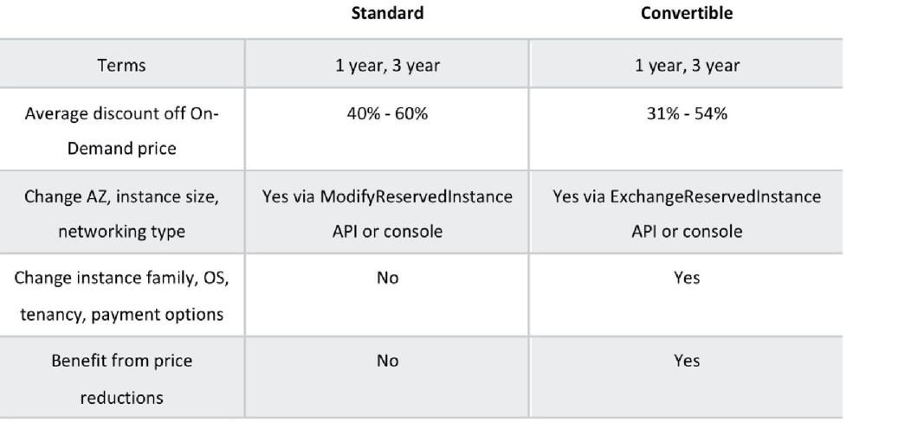

**RI Attributes:**

- Instance type – designates CPU, memory, networking capability.
- Platform – Linux, SUSE Linux, RHEL, Microsoft Windows, Microsoft SQL Server.
- Tenancy – Default (shared) tenancy, or Dedicated tenancy.
- Availability Zone (optional) – if AZ is selected, RI is reserved, and discount applies to that AZ (Zonal RI). If no AZ is specified, no reservation is created but the discount is applied to any instance in the family in any AZ in the region (Regional RI).

----

##### **Comparing Amazon EC2 Pricing Models**

The following table provides a brief comparison of On-demand, Reserved and Spot pricing models:

|On-Demand| Reserved |Spot| 
|---------|----------|----|
|No upfront fee| Options: No upfront, partial upfront or all upfront| No upfront fee|
|Charged by hour or second| Charged by hour or second| Charged by hour or second|
|No commitment| 1 - year or 3 - year commitment| No commitment| 
|Ideal for short term needs or unpredictable workloads| Ideal for steady-state workloads and predictable usage| Ideal for cost-sensitive, compute intensive use cases that can withstand interruption|


**Dedicated hosts and Dedicated instances** 

**Dedicated hosts:**

- Physical servers dedicated just for your use.
- You then have control over which instances are deployed on that host.
- Available as On-Demand or with Dedicated Host Reservation.
- Useful if you have server-bound software licences that use metrics like per-core, per-socket,
    or per-VM.
- Each dedicated host can only run one EC2 instance size and type.
- Good for regulatory compliance or licensing requirements.
- Predictable performance.
- Complete isolation.
- Most expensive option.
- Billing is per host.

----

**Dedicated instances:**

- Virtualized instances on hardware just for you.
- Also uses physically dedicated EC2 servers.
- Does not provide the additional visibility and controls of dedicated hosts (e.g. how instance are placed on a server).
- Billing is per instance.
- May share hardware with other non-dedicated instances in the same account.
- Available as On-Demand, Reserved Instances, and Spot Instances.
- Cost additional $2 per hour per region.

----

The following table describes some of the differences between dedicated instances and dedicated hosts:
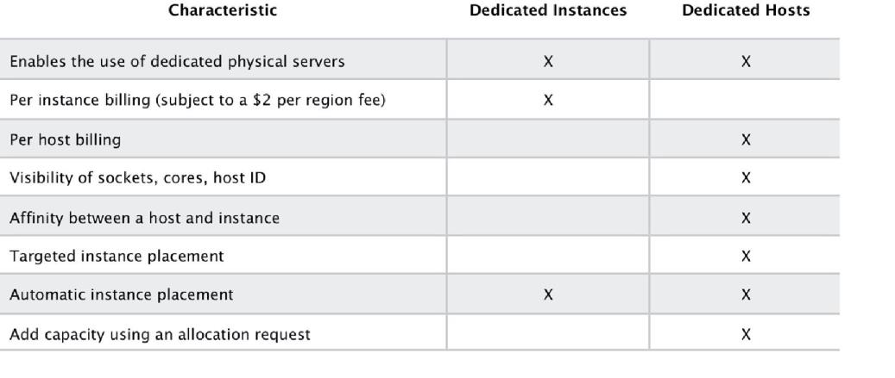

Partial instance - hours consumed are billed based on instance usage.

Instances are billed when they’re in a running state – need to stop or terminate to avoid paying.

Charging by the hour or second (by the second with Linux instances only).

Data between instances in different regions is charged (in and out).

Regional Data Transfer rates apply if at least one of the following is true, but are only charged once for a given instance even if both are true:

- The other instance is in a different Availability Zone, regardless of which type of address is used.
- Public or Elastic IP addresses are used, regardless of which Availability Zone the other instance is in.

#### **EC2 INSTANCE TYPES**

Amazon EC2 provides a wide selection of instance types optimized to fit different use cases.

Instance types comprise varying combinations of CPU, memory, storage, and networking capacity and give you the flexibility to choose the appropriate mix of resources for your applications.

Each instance type includes one or more instance sizes, allowing you to scale your resources to the requirements of your target workload.

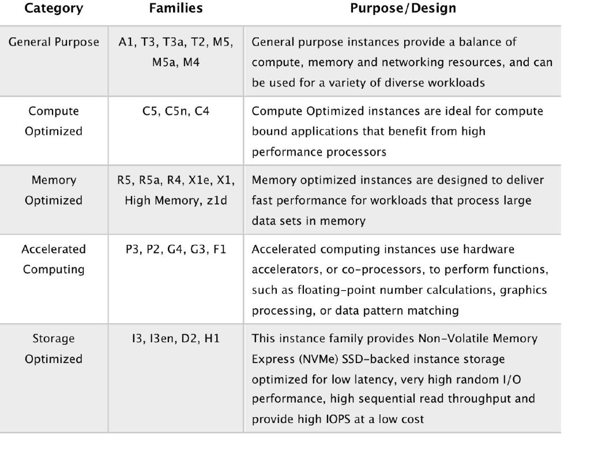

**Options when launching Instances**

Choose whether to auto-assign a public IP – default is to use the subnet setting.

Can add an instance to a placement group.

Instances can be assigned to IAM roles which configures them with credentials to access AWS resources.

Termination protection can be enabled and prevents you from terminating an instance.

Basic monitoring is enabled by default ( 5 - minute periods), detailed monitoring can be enabled (1 minute periods, chargeable).

Can define shared or dedicated tenancy.

T2 unlimited allows applications to burst past CPU performance baselines as required (chargeable).

Can add a script to run on startup (user data).

Can join to a directory (Windows instances only).

There is an option to enable an Elastic GPU (Windows instances only).

Storage options include adding additional volumes and choosing the volume type.

Non-root volumes can be encrypted.

Root volumes can be encrypted if the instance is launched from an encrypted AMI.

There is an option to create tags (or can be done later).

You can select an existing security group or create a new one.

You must create or use an existing key pair – this is required.

#### **AMAZON MACHINE IMAGES**

An Amazon Machine Image (AMI) provides the information required to launch an instance.

An AMI includes the following:

- A template for the root volume for the instance (for example, an operating system, an application server, and applications).
- Launch permissions that control which AWS accounts can use the AMI to launch instances.
- A block device mapping that specifies the volumes to attach to the instance when it’s launched.

AMIs are regional. You can only launch an AMI from the region in which it is stored. However, you can copy AMI’s to other regions using the console, command line, or the API.

Volumes attached to the instance are either EBS or Instance store:

- Amazon Elastic Block Store (EBS) provides persistent storage. EBS snapshots, which reside on Amazon S3, are used to create the volume.
- Instance store volumes are ephemeral (non-persistent). That means data is lost if the instance is shut down. A template stored on Amazon S3 is used to create the volume.

#### EC2 **NETWORKING**

**EC2 networking limitations**

Networking Limits (per Region or as Specified):

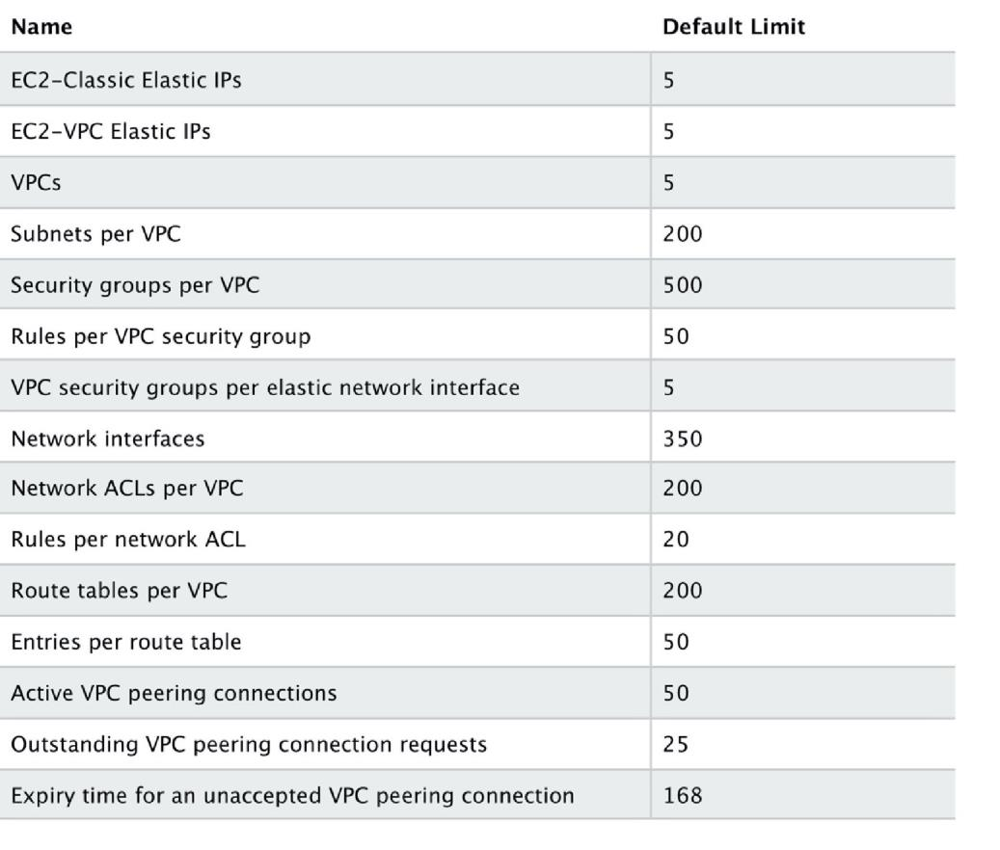

##### **IP Addresses**

There are three types of IP address that can be assigned to an Amazon EC2 instance:

- Public – public address that is assigned automatically to instances in public subnets and reassigned if instance is stopped/started.
- Private – private address assigned automatically to all instances.
- Elastic IP – public address that is static.

Public IPv4 addresses are lost when the instance is stopped but private addresses (IPv4 and IPv6) are retained.

Public IPv4 addresses are retained if you restart the instance.

Elastic IPs are retained when the instance is stopped.

Elastic IP addresses are static public IP addresses that can be remapped (moved) between instances.

**Elastic IP limits - billing - tagging**

All accounts are limited to 5 elastic IP’s per region by default.

AWS charge for elastic IP’s when they’re not being used.

An Elastic IP address is for use in a specific region only.

You can assign custom tags to your Elastic IP addresses to categorize them.


By default, EC2 instances come with a private IP assigned to the primary network interface (eth0).

Public IP addresses are assigned for instances in public subnets (VPC).

Public IP addresses are always assigned for instances in EC2-Classic.

DNS records for elastic IP’s can be configured by filling out a form.

Secondary IP addresses can be useful for hosting multiple websites on a server or redirecting traffic to a standby EC2 instance for HA.

You can choose whether secondary IP addresses can be reassigned.

You can associate a single private IPv4 address with a single Elastic IP address and vice versa.

When reassigned the IPv4 to Elastic IP association is maintained.

When a secondary private address is unassigned from an interface, the associated Elastic IP address is disassociated.

You can assign or remove IP addresses from EC2 instances while they are running or stopped.

All IP addresses (IPv4 and IPv6) remain attached to the network interface when detached or reassigned to another instance.

You can attach a network interface to an instance in a different subnet as long as it’s within the same AZ.

The following table compares the different types of IP address available in Amazon EC2:

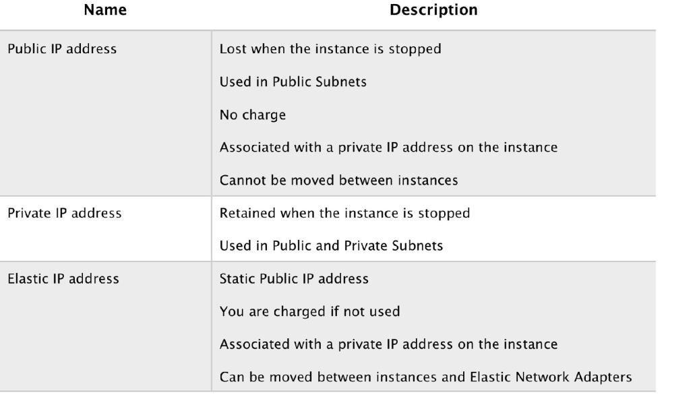

##### **Elastic Network Interfaces**

An elastic network interface (referred to as a network interface in this documentation) is a logical networking component in a VPC that represents a virtual network card.

**A network interface can include the following attributes:**

- A primary private IPv4 address from the IPv4 address range of your VPC
- One or more secondary private IPv4 addresses from the IPv4 address range of your VPC
- One Elastic IP address (IPv4) per private IPv4 address
- One public IPv4 address
- One or more IPv6 addresses
- One or more security groups
- A MAC address
- A source/destination check flag
- A description

You can create and configure network interfaces in your account and attach them to instances in your VPC.

You cannot team by adding ENIs to an instance.

eth0 is the primary network interface and cannot be moved or detached.

By default, eth0 is the only Elastic Network Interface (ENI) created with an EC2 instance when launched.

You can add additional interfaces to EC2 instances (number dependent on instances family/type).

An ENI is bound to an AZ and you can specify which subnet/AZ you want the ENI to be added in.

You can specify which IP address within the subnet to configure or leave it be auto-assigned.

You can only add one extra ENI when launching but more can be attached later.

ENIs can be “hot attached” to running instances.

ENIs can be “warm-attached” when the instance is stopped.

ENIs can be “cold-attached” when the instance is launched.

If you add a second interface AWS will not assign a public IP address to eth0 (you would need to add an Elastic IP).

Default interfaces are terminated with instance termination.

Manually added interfaces are not terminated by default.

You can change the termination behavior.

#### **ENHANCED NETWORKING – ELASTIC NETWORK ADAPTER (ENA)**

Enhanced networking provides higher bandwidth, higher packet-per-second (PPS) performance, and consistently lower inter-instance latencies.

Enhanced networking is enabled using an Elastic Network Adapter (ENA).

If your packets-per-second rate appears to have reached its ceiling, you should consider moving to enhanced networking because you have likely reached the upper thresholds of the VIF driver.

AWS currently supports enhanced networking capabilities using SR-IOV.

SR-IOV provides direct access to network adapters, provides higher performance (packets-per- second) and lower latency.

Must launch an HVM AMI with the appropriate drivers.

Only available for certain instance types.

Only supported in VPC.

#### **ELASTIC FABRIC ADAPTER (EFA)**

An Elastic Fabric Adapter is an AWS Elastic Network Adapter (ENA) with added capabilities. (upgrade version of ENA)

An EFA can still handle IP traffic, but also supports an important access model commonly called OS bypass.

This model allows the application (most commonly through some user-space middleware) access the network interface without having to get the operating system involved with each message.

Elastic Fabric Adapter (EFA) is a network interface for Amazon EC2 instances that enables customers to run applications requiring high levels of inter-node communications at scale on AWS.

Its custom-built operating system (OS) bypass hardware interface enhances the performance of inter-instance communications, which is critical to scaling these applications.

With EFA, High Performance Computing (HPC) applications using the Message Passing Interface (MPI) and Machine Learning (ML) applications using NVIDIA Collective Communications Library (NCCL) can scale to thousands of CPUs or GPUs.

As a result, you get the application performance of on-premises HPC clusters with the on-demand elasticity and flexibility of the AWS cloud.

EFA is available as an optional EC2 networking feature that you can enable on any supported EC2 instance at no additional cost.

#### **ENI VS ENA VS EFA**

**When to use ENI:**

- This is the basic adapter type for when you don't have any high performance requirements.
- Can use with all instance types.

**When to use ENA:**

- Good for use cases that require higher bandwidth and lower inter-instance latency.
- Supported for limited instance types (HVM only).

**When to use EFA:**

- High Performance Computing.
- MPI and ML use cases.
- Tightly coupled applications.
- Can use with all instance types.

#### **PLACEMENT GROUPS**

Placement groups are a logical grouping of instances in one of the following configurations.

**Cluster** – clusters instances into a low-latency group in a single AZ:

- A cluster placement group is a logical grouping of instances within a single Availability Zone.
- Cluster placement groups are recommended for applications that benefit from low network latency, high network throughput, or both, and if the majority of the network traffic is between the instances in the group.

----
**Spread** – spreads instances across underlying hardware (can span AZs):

- A spread placement group is a group of instances that are each placed on distinct underlying hardware.
- Spread placement groups are recommended for applications that have a small number of critical instances that should be kept separate from each other.


----  
**Partition** — divides each group into logical segments called partitions:

- Amazon EC2 ensures that each partition within a placement group has its own set of racks.
- Each rack has its own network and power source. No two partitions within a placement group share the same racks, allowing you to isolate the impact of hardware failure within your application.
- Partition placement groups can be used to deploy large distributed and replicated workloads, such as HDFS, HBase, and Cassandra, across distinct racks.

The table below describes some key differences between clustered and spread placement groups:

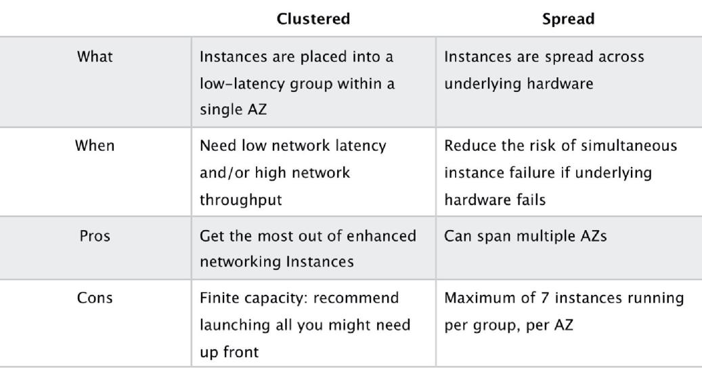

Launching instances in a spread placement group reduces the risk of simultaneous failures that might occur when instances share the same underlying hardware.

Recommended for applications that benefit from low latency and high bandwidth.

Recommended using an instance type that supports enhanced networking.

Instances within a placement group can communicate with each other using private or public IP addresses.

----


Best performance is achieved when using private IP addresses.

Using public IP addresses, the performance is limited to 5Gbps or less.

Low-latency 10 Gbps or 25 Gbps network.

Recommended to keep instance types homogenous within a placement group.

Can use reserved instances at an instance level but cannot reserve capacity for the placement group.

The name you specify for a placement group must be unique within your AWS account for the Region.

You can’t merge placement groups.

An instance can be launched in one placement group at a time; it cannot span multiple placement groups.

On-Demand Capacity Reservation and zonal Reserved Instances provide a capacity reservation for EC2 instances in a specific Availability Zone. The capacity reservation can be used by instances in a placement group. However, it is not possible to explicitly reserve capacity for a placement group.

Instances with a tenancy of host cannot be launched in placement groups.

**IAM ROLES**

IAM roles are more secure than storing access keys and secret access keys on EC2 instances.

IAM roles are easier to manage.

You can attach an IAM role to an instance at launch time or at any time after by using the AWS CLI,
SDK, or the EC2 console.

IAM roles can be attached, modified, or replaced at any time.

Only one IAM role can be attached to an EC2 instance at a time.

IAM roles are universal and can be used in any region.

#### **BASTION/JUMP HOSTS**

You can configure EC2 instances as bastion hosts (aka jump boxes) in order to access your VPC instances for management.

Can use the SSH or RDP protocols to connect to your bastion host.

Need to configure a security group with the relevant permissions.

Can use auto-assigned public IPs or Elastic IPs.

Can use security groups to restrict the IP addresses/CIDRs that can access the bastion host.

Use auto-scaling groups for HA (set to 1 instance to just replace if it fails).

Best practice is to deploy Linux bastion hosts in two AZs, use auto-scaling and Elastic IP addresses.

#### **EC2 MIGRATION**

VM Import/Export is a tool for migrating VMware, Microsoft, XEN VMs to the Cloud.

Can also be used to convert EC2 instances to VMware, Microsoft or XEN VMs.

---- 

**Supported for:**

- Windows and Linux.
- VMware ESX VMDKs and (OVA images for export only).
- Citrix XEN VHD.
- Microsoft Hyper-V VHD.

Can only be used via the API or CLI (not the console).

Stop the VM before generating VMDK or VHD images.

**AWS has a VM connector plugin for vCenter:**

- Allows migration of VMs to S3.
- Then converts into a EC2 AMI.
- Progress can be tracked in vCenter.

#### **MONITORING**

EC2 status checks are performed every minute and each returns a pass or a fail status.

If all checks pass, the overall status of the instance is **OK.**

If one or more checks fail, the overall status is **impaired.**

System status checks detect (StatusCheckFailed_System) problems with your instance that require **AWS** involvement to repair.

Instance status checks (StatusCheckFailed_Instance) detect problems that require **your** involvement to repair.

Status checks are built into Amazon EC2, so they cannot be disabled or deleted.

You can, however, create or delete alarms that are triggered based on the result of the status checks.

You can create Amazon CloudWatch alarms that monitor Amazon EC2 instances and automatically perform an action if the status check fails.

**Actions can include:**

- Recover the instance (only supported on specific instance types and can be used only with StatusCheckFailed_System).
- Stop the instance (only applicable to EBS-backed volumes).
- Terminate the instance (cannot terminate if termination protection is enabled).
- Reboot the instance.

It is a best practice to use EC2 to reboot instance rather than the OS (create a CloudWatch record).

**CloudWatch Monitoring frequency:**

- Standard monitoring = 5 mins
- Detailed monitoring = 1 min (chargeable)

#### **TAGS**

A tag is a label that you assign to an AWS resource.

Used to manage AWS assets.

Tags are just arbitrary name/value pairs that you can assign to virtually all AWS assets to serve as metadata.

Each tag consists of a key and an optional value, both of which you define.

Tagging strategies can be used for cost allocation, security, automation, and many other uses. For example, you can use a tag in an IAM policy to implement access control.

Enforcing standardized tagging can be done via AWS Config rules or custom scripts. For example, EC2 instances not properly tagged are stopped or terminated daily.

Most resources can have up to 50 tags.

#### **RESOURCE GROUPS**

Resource groups are mappings of AWS assets defined by tags.

Create custom consoles to consolidate metrics, alarms and config details around given tags.

##### **HIGH AVAILABILITY APPROACHES FOR COMPUTE**

Up-to-date AMIs are critical for rapid fail-over.

AMIs can be copied to other regions for safety or DR staging.

Horizontally scalable architectures are preferred because risk can be spread across multiple smaller machines versus one large machine.

Reserved instances are the only way to guarantee that resources will be available when needed.

Auto Scaling and Elastic Load Balancing work together to provide automated recovery by
maintaining minimum instances.

Route 53 health checks also provide “self-healing” redirection of traffic.

#### **MIGRATION**

AWS Server Migration Service (SMS) is an agent-less service which makes it easier and faster for you
to migrate thousands of on-premises workloads to AWS.

AWS SMS allows you to automate, schedule, and track incremental replications of live server
volumes, making it easier for you to coordinate large-scale server migrations.

Automates migration of on-premises VMware vSphere or Microsoft Hyper-V/SCVMM virtual
machines to AWS.

Replicates VMs to AWS, syncing volumes and creating periodic AMIs.

Minimizes cutover downtime by syncing VMs incrementally.

Supports Windows and Linux VMs only (just like AWS).


The Server Migration Connector is downloaded as a virtual appliance into your on-premises vSphere
or Hyper-V environments.

### Amazon EBS

#### **GENERAL**

EBS is the Elastic Block Store.

EBS volumes are network attached storage that can be attached to EC2 instances.

EBS volume data persists independently of the life of the instance.

EBS volumes do not need to be attached to an instance.

You can attach multiple EBS volumes to an instance.

You cannot attach an EBS volume to multiple instances (use Elastic File Store instead).

EBS volume data is replicated across multiple servers in an AZ.

EBS volumes must be in the same AZ as the instances they are attached to.

EBS is designed for an annual failure rate of 0.1%-0.2% & an SLA of 99.95%.

Termination protection is turned off by default and must be manually enabled (keeps the
volume/data when the instance is terminated).

Root EBS volumes are deleted on termination by default.

Extra non-boot volumes are not deleted on termination by default.

The behavior can be changed by altering the “DeleteOnTermination” attribute.

You can now create AMIs with encrypted root/boot volumes as well as data volumes (you can also use separate CMKs per volume).

Volume sizes and types can be upgraded without downtime (except for magnetic standard).

Elastic Volumes allow you to increase volume size, adjust performance, or change the volume type while the volume is in use.

To migrate volumes between AZ’s create a snapshot then create a volume in another AZ from the snapshot (possible to change size and type).

Auto-enable IO setting prevents the stopping of IO to a disk when AWS detects inconsistencies.

The root device is created under /dev/sda1 or /dev/xvda.

Magnetic EBS is for workloads that need throughput rather than IOPS.

Throughput optimized EBS volumes cannot be a boot volume.

Each instance that you launch has an associated root device volume, either an Amazon EBS volume or an instance store volume.

You can use block device mapping to specify additional EBS volumes or instance store volumes to attach to an instance when it’s launched.

You can also attach additional EBS volumes to a running instance.

You cannot decrease an EBS volume size.

When changing volumes, the new volume must be at least the size of the current volume’s snapshot.

Images can be made public but not if they’re encrypted.

AMIs can be shared with other accounts.

You can have up to 5,000 EBS volumes by default.

You can have up to 10,000 snapshots by default.

#### **INSTANCE STORE**

An instance store provides _temporary_ (non-persistent) block-level storage for your instance.

This is different to EBS which provides persistent storage but is also a block storage service that can be a root or additional volume.

Instance store storage is located on disks that are physically attached to the host computer.

Instance store is ideal for temporary storage of information that changes frequently, such as buffers, caches, scratch data, and other temporary content, or for data that is replicated across a fleet of instances, such as a load-balanced pool of web servers.

You can specify instance store volumes for an instance only when you launch it.

You can't detach an instance store volume from one instance and attach it to a different instance.

The instance type determines the size of the instance store available and the type of hardware used for the instance store volumes.

Instance store volumes are included as part of the instance's usage cost.

Some instance types use NVMe or SATA-based solid state drives (SSD) to deliver high random I/O performance.

This is a good option when you need storage with very low latency, but you don't need the data to persist when the instance terminates, or you can take advantage of fault-tolerant architectures.

**EXAM TIP:** Instance stores offer very high performance and low latency. As long as you can afford to lose an instance, i.e. you are replicating your data, these can be a good solution for high performance/low latency requirements. Look out for questions that mention distributed or replicated databases that need high I/O. Also, remember that the cost of instance stores is included in the instance charges so it can also be more cost-effective than EBS Provisioned IOPS.

#### **EBS VS INSTANCE STORE**

EBS-backed means the root volume is an EBS volume and storage is persistent.

Instance store-backed means the root volume is an instance store volume and storage is not persistent.

On an EBS-backed instance, the default action is for the root EBS volume to be deleted upon termination.

Instance store volumes are sometimes called Ephemeral storage (non-persistent).

Instance store backed instances cannot be stopped. If the underlying host fails, the data will be lost.

Instance store volume root devices are created from AMI templates stored on S3.

EBS backed instances can be stopped. You will not lose the data on this instance if it is stopped
(persistent).

EBS volumes can be detached and reattached to other EC2 instances.

EBS volume root devices are launched from AMI’s that are backed by EBS snapshots.

Instance store volumes cannot be detached/reattached.

When rebooting the instances for both types data will not be lost.

By default, both root volumes will be deleted on termination unless you configured otherwise.

#### **EBS VOLUME TYPES**

##### **SSD, General Purpose – GP2**

- Baseline of 3 IOPS per GiB with a minimum of 100 IOPS.
- Burst up to 3000 IOPS (for volumes >= 334GB).
- Up to 16,000 IOPS per volume.
- AWS designs gp2 volumes to deliver 90% of the provisioned performance 99% of the time. A
    gp2 volume can range in size from 1 GiB to 16 TiB.

##### **SSD, Provisioned IOPS – I01**

- More than 16,000 IOPS.
- Up to 64,000 IOPS per volume.
- Up to 50 IOPS per GiB.
- Amazon EBS delivers the provisioned IOPS performance 99.9 percent of the time.

##### **HDD, Throughput Optimized – (ST1):**

- Frequently accessed, throughput intensive workloads with large datasets and large I/O sizes, such as MapReduce, Kafka, log processing, data warehouse, and ETL workloads.
- Throughput measured in MB/s, and includes the ability to burst up to 250 MB/s per TB, with a baseline throughput of 40 MB/s per TB and a maximum throughput of 500 MB/s per volume.
- Cannot be a boot volume.

##### **HDD, Cold – (SC1):**

- Lowest cost storage – cannot be a boot volume.
- Less frequently accessed workloads with large, cold datasets.
- These volumes can burst up to 80 MB/s per TB, with a baseline throughput of 12 MB/s per TB and a maximum throughput of 250 MB/s per volume.

HDD, Magnetic – Standard – cheap, infrequently accessed storage – lowest cost storage that cannot
be a boot volume.


##### **EBS optimized instances:**

- Dedicated capacity for Amazon EBS I/O.
- EBS-optimized instances are designed for use with all EBS volume types.
- Max bandwidth: 400 Mbps – 12000 Mbps.
- IOPS: 3000 – 65000.
- GP-SSD within 10% of baseline and burst performance 99.9% of the time.
- PIOPS within 10% of baseline and burst performance 99.9% of the time.
- Additional hourly fee.
- Available for select instance types.
- Some instance types have EBS-optimized enabled by default.

#### **SNAPSHOTS**

Snapshots capture a point-in-time state of an instance.

Cost-effective and easy backup strategy.

Share data sets with other users or accounts.

Can be used to migrate a system to a new AZ or region.

Can be used to convert an unencrypted volume to an encrypted volume.

Snapshots are stored on Amazon S3.

Does not provide granular backup (not a replacement for backup software).

If you make periodic snapshots of a volume, the snapshots are incremental, which means that only the blocks on the device that have changed after your last snapshot are saved in the new snapshot.

Even though snapshots are saved incrementally, the snapshot deletion process is designed so that you need to retain only the most recent snapshot in order to restore the volume.

Snapshots can only be accessed through the EC2 APIs.

EBS volumes are AZ specific but snapshots are region specific.

Volumes can be created from EBS snapshots that are the same size or larger.

Snapshots can be taken of non-root EBS volumes while running.

To take consistent snapshots writes must be stopped (paused) until the snapshot is complete – if not possible the volume needs to be detached, or if it’s an EBS root volume the instance must be stopped.

To lower storage costs on S3 a full snapshot and subsequent incremental updates can be created.

You are charged for data traffic to S3 and storage costs on S3.

You are billed only for the changed blocks.

Deleting a snapshot removes only the data not needed by any other snapshot.

You can resize volumes through restoring snapshots with different sizes (configured when taking the snapshot).

Snapshots can be copied between regions (and be encrypted). Images are then created from the snapshot in the other region which creates an AMI that can be used to boot an instance.

You can create volumes from snapshots and choose the availability zone within the region.

### **ENCRYPTION**

You can encrypt both the boot and data volumes of an EC2 instance. When you create an encrypted EBS volume and attach it to a supported instance type, the following types of data are encrypted:

- Data at rest inside the volume.
- All data moving between the volume and the instance.
- All snapshots created from the volume.
- All volumes created from those snapshots.

Encryption is supported by all EBS volume types.

Expect the same IOPS performance on encrypted volumes as on unencrypted volumes.

All instance families support encryption.

**Amazon EBS encryption is available on the instance types listed below:**

- General purpose: A1, M3, M4, M5, M5a, M5ad, M5d, T2, T3, and T3a.
- Compute optimized: C3, C4, C5, C5d, and C5n.
- Memory optimized: cr1.8xlarge, R3, R4, R5, R5a, R5ad, R5d, u-6tb1.metal, u-9tb1.metal, u- 12tb1.metal, X1, X1e, and z1d.
- Storage optimized: D2, h1.2xlarge, h1.4xlarge, I2, and I3.
- Accelerated computing: F1, G2, G3, G4, P2, and P3.

EBS encrypts your volume with a data key using the industry-standard AES- 256 algorithm.

Your data key is stored on-disk with your encrypted data, but not before EBS encrypts it with your CMK. Your data key never appears on disk in plaintext..

The same data key is shared by snapshots of the volume and any subsequent volumes created from those snapshots.

Snapshots of encrypted volumes are encrypted automatically.

EBS volumes restored from encrypted snapshots are encrypted automatically.

EBS volumes created from encrypted snapshots are also encrypted.

You can share snapshots, but if they’re encrypted it must be with a custom CMK key.

There is no direct way to change the encryption state of a volume.

Either create an encrypted volume and copy data to it or take a snapshot, encrypt it, and create a new encrypted volume from the snapshot.

To encrypt a volume or snapshot you need an encryption key, these are customer managed keys (CMK) and they are managed by the AWS Key Management Service (KMS).

A default CMK key is generated for the first encrypted volumes.

Subsequent encrypted volumes will use their own unique key (AES 256 bit).

The CMK used to encrypt a volume is used by any snapshots and volumes created from snapshots.

You cannot share encrypted volumes created using a default CMK key.

You cannot change the CMK key that is used to encrypt a volume.

You must create a copy of the snapshot and change encryption keys as part of the copy.

This is required in order to be able to share the encrypted volume.

By default, only the account owner can create volumes from snapshots.

You can share unencrypted snapshots with the AWS community by making them public.

You can also share unencrypted snapshots with other AWS accounts by making them private and selecting the accounts to share them with.

You cannot make encrypted snapshots public.

You can share encrypted snapshots with other AWS accounts using a non-default CMK key and configuring cross-account permissions to give the account access to the key, mark as private and configure the account to share with.

The receiving account must copy the snapshot before they can then create volumes from the snapshot.

It is recommended that the receiving account re-encrypt the shared and encrypted snapshot using their own CMK key.

---- 

**The following information applies to snapshots:**

- Snapshots are created asynchronously and are incremental.
- You can copy unencrypted snapshots (optionally encrypt).
- You can copy an encrypted snapshot (optionally re-encrypt with a different key).
- Snapshot copies receive a new unique ID.
- You can copy within or between regions.
- You cannot move snapshots, only copy them.
- You cannot take a copy of a snapshot when it is in a “pending” state, it must be “complete”.
- S3 Server Side Encryption (SSE) protects data in transit while copying.
- User defined tags are not copied.
- You can have up to 5 snapshot copy requests running in a single destination per account.
- You can copy Import/Export service, AWS Marketplace, and AWS Storage Gateway snapshots.
- If you try to copy an encrypted snapshot without having access to the encryption keys it will fail silently (cross-account permissions are required).

**Copying snapshots may be required for:**

- Creating services in other regions.
- DR – the ability to restore from snapshot in another region.
- Migration to another region.
- Applying encryption.
- Data retention.

----

**To take application-consistent snapshots of RAID arrays:**

- Stop the application from writing to disk.
- Flush all caches to the disk.
- Freeze the filesystem.
- Unmount the RAID array.
- Shut down the associated EC2 instance.

#### **AMIS**

An Amazon Machine Image (AMI) is a special type of virtual appliance that is used to create a virtual machine within the Amazon Elastic Compute Cloud (“EC2”).

**An AMI includes the following:**

- A template for the root volume for the instance (for example, an operating system, an application server, and applications).
- Launch permissions that control which AWS accounts can use the AMI to launch instances.
- A block device mapping that specifies the volumes to attach to the instance when it’s launched.

AMIs are either instance store-backed or EBS-backed.

----

**Instance store-backed:**

- Launch an EC2 instance from an AWS instance store-backed AMI.
- Update the root volume as required.
- Create the AMI which will upload to a user-specified S3 bucket (user bucket).
- Register the AMI with EC2 (creates another EC2 controlled S3 image).
- To make changes update the source then deregister and reregister.
- Upon launch the image is copied to the EC2 host.
- Deregister an image when the AMI is not needed anymore (does not affect existing instances created from the AMI).
- Instance store-backed volumes can only be created at launch time.

----

**EBS-backed:**

- Must stop the instance to create a consistent image and then create the AMI.
- AWS registers the AMIs manually.
- During creation AWS creates snapshots of all attached volumes – there is no need to specify a bucket but you will be charged for storage on S3.
- You cannot delete the snapshot of the root volume as long as the AMI is registered (deregister and delete).
- You can now create AMIs with encrypted root/boot volumes as well as data volumes (can also use separate CMKs per volume).

----

**Copying AMIs:**

- You can copy an Amazon Machine Image (AMI) within or across an AWS region using the AWS Management Console, the AWS AWS Command Line Interface or SDKs, or the Amazon EC2 API, all of which support theCopyImage action.
- You can copy both Amazon EBS-backed AMIs and instance store-backed AMIs.
- You can copy encrypted AMIs and AMIs with encrypted snapshots.

#### **EBS COPYING, SHARING AND ENCRYPTION METHODS**

The following diagram aims to articulate the various possible options for copying EBS volumes, sharing AMIs and snapshots and applying encryption:

#### **RAID**

RAID can be used to increase IOPS.

RAID 0 = 0 striping – data is written across multiple disks and increases performance but no redundancy.

RAID 1 = 1 mirroring – creates 2 copies of the data but does not increase performance, only redundancy.

RAID 10 = 10 combination of RAID 1 and 2 resulting in increase performance and redundancy (at the cost of additional disks).

You can configure multiple striped gp2 or standard volumes (typically RAID 0).

You can configure multiple striped PIOPS volumes (typically RAID 0).

RAID is configured through the guest OS.

EBS optimized EC2 instances are another way of increasing performance.

Ensure the EC2 instance can handle the bandwidth required for the increased performance.

Use EBS optimized instances or instances with a 10 Gbps network interface.

Not recommended to use RAID for root/boot volumes.

#### **EBS LIMITS (PER REGION)**

### ELASTIC LOAD BALANCING

#### **GENERAL ELB CONCEPTS**

Elastic Load Balancing automatically distributes incoming application traffic across multiple targets, such as Amazon EC2 instances, containers, and IP addresses.

**There are three types of Elastic Load Balancer (ELB) on AWS:**

- Classic Load Balancer (CLB) – this is the oldest of the three and provides basic load balancing at both layer 4 and layer 7.
- Application Load Balancer (ALB) – layer 7 load balancer that routes connections based on the content of the request.
- Network Load Balancer (NLB) – layer 4 load balancer that routes connections based on IP protocol data.

Note: The Classic Load Balancer may be phased out over time and Amazon are promoting the ALB and NLB for most use cases within VPC.

The following image provides an overview of some of the key differences between the three types of ELB:

The following table provides a more detailed feature comparison:

Elastic Load Balancing provides fault tolerance for applications by automatically balancing traffic across targets – Amazon EC2 instances, containers and IP addresses – and Availability Zones while ensuring only healthy targets receive traffic.

An ELB can distribute incoming traffic across your Amazon EC2 instances in a single Availability Zone or multiple Availability Zones.

Only 1 subnet per AZ can be enabled for each ELB.

Route 53 can be used for region load balancing with ELB instances configured in each region.

**ELBs can be Internet facing or internal-only.**

**Internet facing ELB:**

- ELB nodes have public IPs.
- Routes traffic to the private IP addresses of the EC2 instances.
- Need one public subnet in each AZ where the ELB is defined.
- ELB DNS name format: <name>-<id-number>.<region>.elb.amazonaws.com.

**Internal only ELB:**

- ELB nodes have private IPs.
- Routes traffic to the private IP addresses of the EC2 instances.
- ELB DNS name format: **internal** - <name>-<id-number>.<region>.elb.amazonaws.com.

Internal-only load balancers do not need an Internet gateway.

EC2 instances and containers can be registered against an ELB.

ELB nodes use IP addresses within your subnets, ensure at least a /27 subnet and make sure there are at least 8 IP addresses available in order for the ELB to scale.

An ELB forwards traffic to eth0 (primary IP address).

**An ELB listener is the process that checks for connection requests:**

- Listeners for CLB provide options for TCP and HTTP/HTTPS.
- Listeners for ALB only provide options for HTTP and HTTPS.
- Listeners for NLB only provide TCP as an option.

Deleting an ELB does not affect the instances registered against it (they won’t be deleted; they just won’t receive any more requests).

For ALB at least 2 subnets must be specified.

For NLB only one subnet must be specified (recommended to add at least 2).

For CLB you don’t need to specify any subnets unless you have “Enable advanced VPC configuration” enabled in which case you must specify two.

ELB uses a DNS record TTL of 60 seconds to ensure new ELB node IP addresses are used to service clients.

By default, the ELB has an idle connection timeout of 60 seconds, set the idle timeout for applications to at least 60 seconds.

Perfect Forward Secrecy (PFS) provides additional safeguards against the eavesdropping of encrypted data, through the use of a unique random session key.

Server Order Preference lets you configure the load balancer to enforce cipher ordering, providing more control over the level of security used by clients to connect with your load balancer.

ELB does not support client certificate authentication (API Gateway does support this).

#### **ELB SECURITY GROUPS**

Security groups control the ports and protocols that can reach the front-end listener.

In non-default VPCs you can choose which security group to assign.

You must assign a security group for the ports and protocols on the front-end listener.

You need to also allow the ports and protocols for the health check ports and back-end listeners.

**Security group configuration for ELB:**

**Inbound to ELB (allow)**

- Internet-facing ELB:
    - Source: 0.0.0.0/0.
    - Protocol: TCP.
    - Port: ELB listener ports.
    
**Internal-only ELB:**

- Source: VPC CIDR.
- Protocol: TCP.
- Port: ELB Listener ports.

**Outbound (allow, either type of ELB):**

- Destination: EC2 registered instances security group.
- Protocol: TCP.
- Port: Health Check/Listener.

**Security group configuration for registered instances:**

Inbound to registered instances (Allow, either type of ELB).

- Source: ELB Security Group.
- Protocol: TCP.
- Port: Health Check/Listener.


**Outbound (Allow, for both types of ELB).**

- Destination: ELB Security Group.
- Protocol: TCP.
- Port: Ephemeral.

It is also important to ensure NACL settings are set correctly.

**Distributed Denial of Service (DDoS) protection:**

- ELB automatically distributes incoming application traffic across multiple targets, such as Amazon Elastic Compute Cloud (Amazon EC2) instances, containers, and IP addresses, and multiple Availability Zones, which minimizes the risk of overloading a single resource.
- ELB, like CloudFront, only supports valid TCP requests, so DDoS attacks such as UDP and SYN floods are not able to reach EC2 instances.
- ELB also offers a single point of management and can serve as a line of defence between the internet and your backend, private EC2 instances.

#### **ELB MONITORING**

Monitoring takes place using:

- **CloudWatch – every 1 minute**
    - ELB service only sends information when requests are active.
    - Can be used to trigger SNS notifications.
- **Access Logs**
    - Disabled by default.
    - Includes information about the clients (not included in CloudWatch metrics).
    - Can identify requester, IP, request type etc.
    - Can be optionally stored and retained in S3.
- **CloudTrail**
    - Can be used to capture API calls to the ELB.
    - Can be stored in an S3 bucket.

#### **LIMITS**

The following table details the default limits for your account on a per-region basis:

[comment]: <> (//TODO )

#### **CLASSIC LOAD BALANCER (CLB)**

The Classic Load Balancer provides basic load balancing across multiple Amazon EC2 instances and operates at both the request level and connection level.

Operates at layer 4 and layer 7.

Supported protocols: TCP, SSL, HTTP, HTTPS.

CLB does not support HTTP/2.

#### **Load balancers can listen on the following ports:**

- [EC2-VPC] 1 - 65535.
- [EC2-Classic] 25, 80, 443, 465, 587, 1024 - 65535.

CLB’s do not have pre-defined IPv4 addresses but are resolved using a DNS name.

Does not support Elastic IPs.

Supports IPv4 and IPv6.

Within a VPC only IPv4 is supported.

Provides SSL termination and processing.

#### **Sticky Sessions:**
- Cookie-based sticky sessions are supported.
- Session stickiness uses cookies and ensures a client is bound to an individual back-end instance for the duration of the cookie lifetime.
- Cookies can be inserted by the application or by the load balancer when configured.
- After cookies expire new requests will be routed by the load balancer normally and a new cookie will be inserted and bind subsequent sessions to the same back-end instance.
- With application-inserted cookies if the back-end instance becomes unhealthy, new requests will be routed by the load balancer normally and a new cookie will be inserted and bind subsequent sessions to the same back-end instance.
- With CLB-inserted cookies if the back-end instance becomes unhealthy, new requests will be routed by the load balancer normally BUT the session will no longer be sticky.
Must have multiple CLBs for multiple SSL certs.

Integrates with Auto Scaling, CloudWatch, CloudTrail and Route 53.

Instances monitored by CLB are reported as InService or OutofService.

Supports domain zone apex records, e.g. example.com.

Wildcard certificates are supported.

#### **Health checks:**

- Can be configured for HTTP, TCP, HTTPS, SSL.
- Ping port specifies the port for the health check.
- Ping path specifies the path to check, e.g. /index.html.
- Can define timeout, interval, unhealthy threshold, healthy threshold.

For fault tolerance it is recommended to distribute registered instances across multiple AZs (ideally evenly).

#### **Cross-zone load balancing:**

- Cross-zone load balancing is enabled by default for CLB and ALB but not for NLB (when created through the console).
- Cross-zone load balancing is NOT enabled by default if the CLB is created from the CLI or API.
- You can enable or disable cross-zone load balancing on the CLB and NLB at any time.
- For the ALB, cross-zone load balancing is always on and cannot be disabled.
- When cross-zone load balancing is enabled, each load balancer node distributes traffic across the registered targets in all enabled Availability Zones.
- When cross-zone load balancing is disabled, each load balancer node distributes traffic across the registered targets in its Availability Zone only.

Connection draining is enabled by default and provides a period of time for existing connections to close cleanly.

When connection draining is in action a CLB will be in the status “InService: Instance deregistration currently in progress”.

CLB can take 1 to 7 minutes to detect an increase in load and scale.

If you’re anticipating a fast increase in load you can contact AWS and instruct them to pre-warm (provision) additional CLB nodes.

#### **Listeners:**

- A CLB listener is the process that checks for connection requests.
- You can configure the protocol/port on which your CLB listener listens.
- Front-end listeners check for traffic from clients to the CLB.
- Back-end listeners are configured with the protocol/port to check for traffic from the CLB to the EC2 instances.
- Front-end and back-end listeners can listen on ports 1 - 65535.
- Front-end and back-end listeners must be at the same layer (e.g. layer 4 or layer 7).
- There is a 1:1 mapping between front-end and back-end listeners.
- Up to 100 listeners can be configured.
- Supports L4 (TCP, SSL) and L7 (HTTP, HTTPS) listeners.

With packet interception the source IP/port will be from the ELB.

Proxy protocol for TCP/SSL carries the source (client) IP/port information.

The Proxy Protocol header helps you identify the IP address of a client when you have a load balancer that uses TCP for back-end connections.

Ensure the client doesn’t go through a proxy or there will be multiple proxy headers.

Also need to ensure the EC2 instance’s TCP stack can process the extra information.

X-forwarded-for for HTTP/HTTPS carries the source IP/port information.

To use an HTTPS listener the CLB must have an X.509 SSL/TLS server certificate – this will allow the CLB to terminate the secure session from the client to the CLB.

The session between the CLB and the EC2 instance can be re-encrypted.

You can use a certificate generated by AWS Certificate Manager (ACM) or your own certificate.

If you don’t want interception/offloading you can use TCP listeners with certificates on the EC2 instances (traffic is secured end-to-end).

Proxy protocol only applies to L4.

X-forwarded-for only applies to L7.

To filter by source IP use NACLs for proxy protocol (L4) / X-forwarded-for (L7) headers with the EC2 instance’s application performing the filtering.

#### **Security**

CLB supports a single X.509 certificate.

Two-way authentication with client certificates is not supported on the CLB – you would need to pass through the session using the proxy protocol and have an application that supports client-side certificates.

When using end-to-end encryption use TCP not SSL/HTTPS on the CLB (does not support Session Stickiness).

AWS ACM certificates include an RSA public key – ensure you include a set of ciphers that support RSA in the security policy.

The latest predefined security policy does not include support for SSLv3.

When choosing a custom security policy, you can select the ciphers and protocols (only for CLB).

#### **SSL Security Policy includes:**

- Protocol Versions (SSL/TLS)
    - Supports TLS 1.0, 1.1, 1.2, SSL 3.0
- SSL Ciphers
    - Encryption algorithms
    - SSL can use different ciphers to encrypt data
- Server Order Preference
    - When enabled the first match in the cipher list with the Client list is used

If disabled (default) the first match in the client cipher list with the CLB is used

### **APPLICATION LOAD BALANCER (ALB)**

The Application Load Balancer operates at the request level (layer 7), routing traffic to targets – EC2 instances, containers and IP addresses based on the content of the request.

You can load balance HTTP/HTTPS applications and use layer 7 - specific features, such as X- Forwarded-For headers.

Supports HTTPS termination between the clients and the load balancer.

Supports management of SSL certificates through AWS IAM and AWS Certificate Manager for pre- defined security policies.

Server Name Indication (SNI) supports multiple secure websites using a single secure listener.

With Server Name Indication a client indicates the hostname to connect to.

IP addresses as targets allows load balancing any application hosted in AWS or on-premises using IP addresses of the application back-ends as targets.

Need at least 2 availability zones and you can distribute incoming traffic across your targets in multiple Availability Zones.

Automatically scales its request handling capacity in response to incoming application traffic.

Can configure an Application Load Balancer to be Internet facing or create a load balancer without public IP addresses to serve as an internal (non-Internet-facing) load balancer.

Native IPv6 support.

Internal only ALB only supports IPv4.

#### **Content-Based Routing allows the routing of requests to a service based on the content of the request:**

- Host-based routing – route client requests based on the Host field of the HTTP header allowing you to route to multiple domains from the same load balancer.
- Path-based routing – route a client request based on the URL path of the HTTP header (e.g. /images or /orders).

Provides support for micro-services and containers with load balancing across multiple ports on a single EC2 instance.

Better performance for real-time streaming.

Deletion protection can be enabled.

Request tracing (allows you to track a request by its unique ID).

Better health checks and CloudWatch metrics.

Integration with Amazon Cognito for user authentication.

Uses a round-robin load balancing algorithm.

Slow start mode allows targets to “warm up” with a ramp-up period.

#### **Health Checks:**

- Can have custom response codes in health checks (200-399).
- There are more details provided in the API and management console for health check failures.
- Reason codes are returned with failed health checks.
- Health checks do not support WebSockets.
- Fail open means if no AZ contains a healthy target, the load balancer nodes route requests to all targets.

Detailed access log information is provided and saved to an S3 bucket every 5 or 6 minutes.

ALB does not support back-end server authentication (CLB does).

ALB does not support EC2-Classic (CLB does).

Deletion protection is possible.

Deregistration delay is similar to connection draining.

#### **Sticky Sessions:**

- Session stickiness uses cookies and ensures a client is bound to an individual back-end instance for the duration of the cookie lifetime.
- ALB supports load balancer-generated cookies only.
- The name of the cookie is AWSALB.
- The contents of these cookies are encrypted using a rotating key.
- You cannot decrypt or modify load balancer-generated cookies.
- Sticky sessions are enabled at the target group level.
- You can also set the duration for the stickiness of the load balancer-generated cookie, in seconds.
- WebSockets connections are inherently sticky (following the upgrade process).

#### **Monitoring**

CloudTrail can be used to capture API calls. Only pay for the S3 storage charges.

CloudTrail records information on API calls only.

To monitor other actions such as time the request was received, the client’s IP address, request paths etc. use access logs. 

Access logging is optional and disabled by default.

You are only charged for the S3 storage.

ALB logs requests sent to the load balancer including requests that never made it to targets.

ALB does not log health check requests.

#### **Logging of requests is best effort so shouldn’t be relied on for auditing Target groups**

Target groups are a logical grouping of targets (EC2 instances or ECS).

Targets are the endpoints and can be EC2 instances, ECS containers, or IP addresses.

Target groups can exist independently from the ALB.

Target groups can have up to 1000 targets.

A single target can be in multiple target groups.

Only one protocol and one port can be defined per target group.

The target type in a target group can be an EC2 instance ID, IP address (must be a valid private IP from an existing subnet) or AWS Lambda Function (ALB only).

You cannot use public IP addresses as targets.

You cannot use instance IDs and IP address targets within the same target group.

A target group can only be associated with one load balancer.

The following diagram illustrates the basic components. Notice that each listener contains a default rule, and one listener contains another rule that routes requests to a different target group. One target is registered with two target groups.


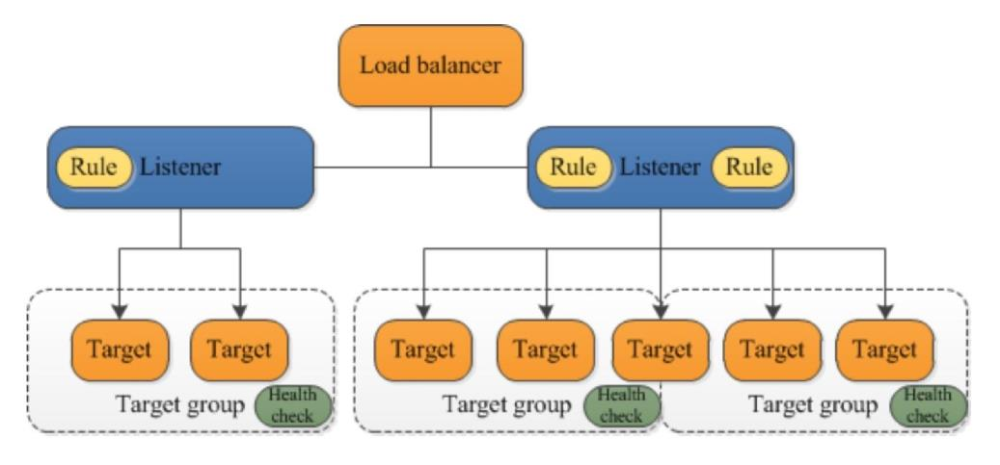

Target groups are used for registering instances against an ALB or NLB.

Target groups are a regional construct.

The following diagram shows how target groups can be used with host-based and target-based
routing to route traffic to multiple websites, running on multiple ports, on a single EC2 instance:


**The following attributes can be defined:**

- Deregistration delay – the amount of time for Elastic Load Balancing to wait before
    deregistering a target.
- Slow start duration – the time period, in seconds, during which the load balancer sends a
    newly registered target a linearly increasing share of the traffic to the target group.
- Stickiness – indicates whether sticky sessions are enabled.

The default settings for attributes are shown below:

Auto Scaling groups can scale each target group individually.

You can only use Auto Scaling with the load balancer if using instance IDs in your target group.

Health checks are defined per target group.

ALB can route to multiple target groups.

You can register the same EC2 instance or IP address with the same target group multiple times
using different ports (used for routing requests to micro-services).

If you register by instance ID the traffic is routed using the primary private IP address of the primary
network interface.

If you register by IP address you can route traffic to an instance using any private address from one
or more network interfaces.

You cannot mix different types within a target group (EC2, ECS, IP).

An EC2 instance can be registered with the same target group multiple times using multiple ports.


**IP addresses can be used to register:**

- Instances in a peered VPC.
- AWS resources that are addressable by IP address and port.
- On-premises resources linked to AWS through Direct Connect or a VPN connection.

**Listeners and Rules**

**Listeners:**

- Each ALB needs at least one listener and can have up to 10.
- Listeners define the port and protocol to listen on.
- Can add one or more listeners.
- Cannot have the same port in multiple listeners.

**Listener rules:**

- Rules determine how the load balancer routes requests to the targets in one or more target
    groups.
- Each rule consists of a priority, one or more actions, an optional host condition, and an
    optional path condition.
- Only one action can be configured per rule.
- One or more rules are required.
- Each listener has a default rule and you can optionally define additional rules.
- Up to 100 rules per ALB.
- Rules determine what action is taken when the rule matches the client request.
- Rules are defined on listeners.
- You can add rules that specify different target groups based on the content of the request
    (content-based routing).
- If no rules are found the default rule will be followed which directs traffic to the default
    target groups.

The image below shows a ruleset with a host-based and path-based entry and a default rule at the
end:

**Default rules:**

- When you create a listener, you define an action for the default rule.


- Default rules cannot have conditions.
- You can delete the non-default rules for a listener at any time.
- You cannot delete the default rule for a listener.
- When you delete a listener all of its rules are deleted.
- If no conditions for any of a listener’s rules are met, the action for the default rule is taken.

**Rule priority:**

- Each rule has a priority and they are evaluated in order of lowest to highest.
- The default rule is evaluated last.
- You can change the value of a non-default rule at any time.
- You cannot change the value of the default rule.

**Rule action:**

- Only one target group per action.
- Each rule has a type and a target group.
- The only supported action type is forward, which forwards requests to the target group.
- You can change the target group for a rule at any time.

**Rule conditions:**

- There are two types of rule condition: host and path.
- When the conditions for a rule are met the action is taken.
- Each rule can have up to 2 conditions, 1 path condition and 1 host condition.
- Optional condition is the path pattern you want the ALB to evaluate in order for it to route
    requests.

**Request routing:**

- After the load balancer receives a request it evaluates the listener rules in priority order to determine which rule to apply, and then selects a target from the target group for the rule action using the round robin routing algorithm.
- Routing is performed independently for each target group even when a target is registered with multiple target groups.
- You can configure listener rules to route requests to different target groups based on the content of the application traffic.

**Content-based routing:**

- ALB can route requests based on the content of the request in the host field: host-based or path-based.
- Host-based is domain name-based routing e.g. example.com or app1.example.com.
- The host field contains the domain name and optionally the port number.
- Path-based is URL based routing e.g. example.com/images, example.com/app1.
- You can also create rules that combine host-based and path-based routing.
- Anything that doesn’t match content routing rules will be sent to a default target group.

### **ALB and ECS**

ECS service maintains the “desired count” of instances.

Optionally a load balancer can distribute traffic across tasks.

All containers in a single task definition are placed on a single EC2 container instance.

**You can put multiple containers in the same task definition behind a CLB.**

- Define multiple host ports in the service definition.
- Define these listener ports as listeners on the CLB.

ECS service can only use a single load balancer.

If your task definition requires multiple ports per container you must use a CLB with multiple listeners.

ALB cannot do multiple listeners on a single task definition.

AWS does not recommend connecting multiple services to the same CLB.

ALB allows containers to use dynamic host port mapping so that multiple tasks from the same service are allowed on the same container host.

ALB supports path-based routing and priority rules.

ALB integrates with EC2 container service using service load balancing.

If a service uses multiple ports then multiple task definitions will need to be created with multiple target groups.

**Federated authentication:**

- ALB now supports authentication from OIDC compliant identity providers such as Google, Facebook and Amazon.
- Implemented through an authentication action on a listener rule that integrates with Amazon Cognito to create user pools.
- AWS SAM can also be used with Amazon Cognito.

### **NETWORK LOAD BALANCER**

Network Load Balancer operates at the connection level (Layer 4), routing connections to targets – Amazon EC2 instances, containers and IP addresses based on IP protocol data.

It is architected to handle millions of requests/sec, sudden volatile traffic patterns and provides extremely low latencies.

**Network Load Balancer supports features including:**

- WebSockets
- TLS termination
- Preserves the source IP of the clients
- Provides stable IP support and Zonal isolation
- Long-running connections that are very useful for WebSocket type applications

High throughput – designed to handle traffic as it grows and can load balance millions of requests/second.

Extremely low latencies for latency-sensitive applications.

Uses static IP addresses – each NLB provides a single IP address for each AZ.

Can also assign an Elastic IP to the load balancer per AZ.

The IP-per-AZ feature reduces latency with improved performance, improves availability through isolation and fault tolerance and makes the use of NLBs transparent to your client applications.

Preserves the source IP of clients and provides stable IP support and Zonal isolation.

Can load balance any application hosted in AWS or on-premises using IP addresses of the application back-ends as targets.

NLB supports connections from clients to IP-based targets in peered VPCs across different AWS Regions.

Supports both network and application target health checks.

Supports long-running/lived connections (ideal for WebSocket applications).

Supports failover between IP addresses within and across regions (uses Route 53 health checks).

Integration with Route 53 enables the removal of a failed load balancer IP address from service and
subsequent redirection of traffic to an alternate Network Load Balancer in another region.

Supports cross-zone load balancing (not enabled by default when created through the console, unlike ALB and CLB).

Uses the same API as the Application Load Balancer.

Also uses Target Groups (see section above).

**Target groups for Network Load Balancers support the following protocols and ports:**

- **Protocols:** TCP, TLS, UDP, TCP_UDP.
- **Ports:** 1 - 65535.

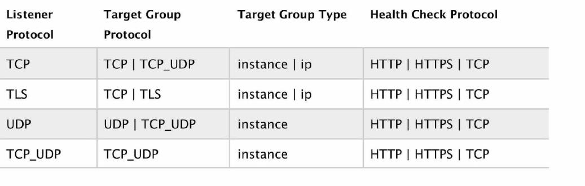

The following table summarizes the supported combinations of listener protocol and target group settings:

CloudWatch reports Network Load Balancer metrics.

Enhanced logging – can use the Flow Logs feature to record all requests sent to your load balancer.

### **AWS AUTO SCALING**

#### **AMAZON EC2 AUTO SCALING**

AWS Auto Scaling monitors your applications and automatically adjusts capacity to maintain steady, predictable performance at the lowest possible cost.

AWS Auto Scaling refers to a collection of Auto Scaling capabilities across several AWS services.

**The services within the AWS Auto Scaling family include:**

- Amazon EC2 (known as Amazon EC2 Auto Scaling)
- Amazon ECS
- Amazon DynamoDB
- Amazon Aurora

#### **GENERAL AUTO SCALING CONCEPTS**

Amazon EC2 Auto Scaling helps you ensure that you have the correct number of Amazon EC2 instances available to handle the load for your application.

You create collections of EC2 instances, called Auto Scaling groups.

Automatically provides horizontal scaling (scale-out) for your instances.

Triggered by an event of scaling action to either launch or terminate instances.

Availability, cost, and system metrics can all factor into scaling.

Auto Scaling is a region-specific service.

Auto Scaling can span multiple AZs within the same AWS region.

Auto Scaling can be configured from the Console, CLI, SDKs and APIs.

There is no additional cost for Auto Scaling, you just pay for the resources (EC2 instances) provisioned.

Auto Scaling works with ELB, CloudWatch and CloudTrail.

You can determine which subnets Auto Scaling will launch new instances into.

Auto Scaling will try to distribute EC2 instances evenly across AZs.

Launch configuration is the template used to create new EC2 instances and includes parameters such as instance family, instance type, AMI, key pair and security groups.

You cannot edit a launch configuration once defined.

**A launch configuration:**

- Can be created from the AWS console or CLI.
- You can create a new launch configuration, or.
- You can use an existing running EC2 instance to create the launch configuration.
    - The AMI must exist on EC2.
    - EC2 instance tags and any additional block store volumes created after the instance launch will not be taken into account.
- If you want to change your launch configurations you have to create a new one, make the required changes, and use that with your auto scaling groups.

You can use a launch configuration with multiple Auto Scaling Groups (ASG).

An ASG is a logical grouping of EC2 instances managed by an Auto Scaling Policy.

An ASG can be edited once defined.

You can attach one or more classic ELBs to your existing ASG.

You can attach one or more Target Groups to your ASG to include instances behind an ALB.

The ELBs must be in the same region.

Once you do this any EC2 instance existing or added by the ASG will be automatically registered
with the ASG defined ELBs.

If adding an instance to an ASG would result in exceeding the maximum capacity of the ASG the request will fail.

**You can add a running instance to an ASG if the following conditions are met:**

- The instance is in a running state.
- The AMI used to launch the instance still exists.
- The instance is not part of another ASG.
- The instance is in the same AZs for the ASG.

#### **SCALING**

The scaling options define the triggers and when instances should be provisioned/de-provisioned.

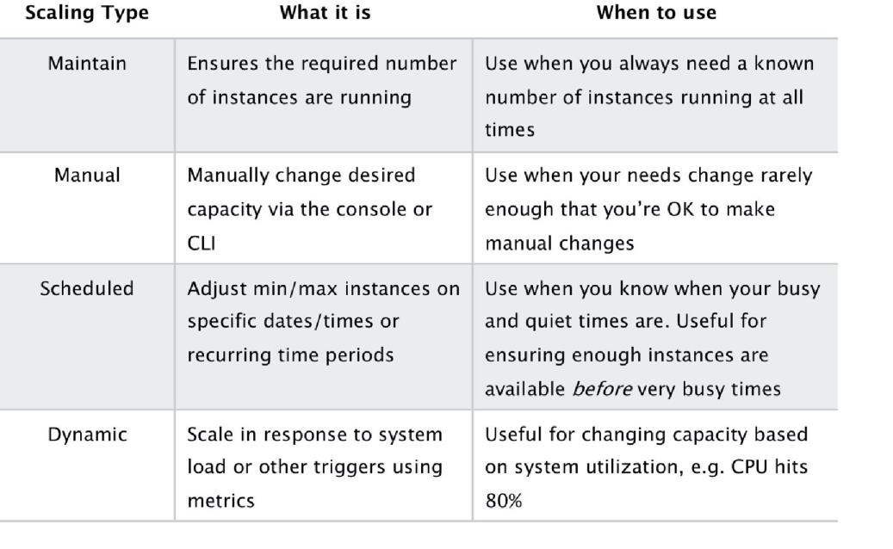

**There are four scaling options:**

- Maintain – keep a specific or minimum number of instances running.
- Manual – use maximum, minimum, or a specific number of instances.
- Scheduled – increase or decrease the number of instances based on a schedule.
- Dynamic – scale based on real-time system metrics (e.g. CloudWatch metrics).

The following table describes the scaling options available and when to use them:


The scaling options are configured through Scaling Policies which determine when, if, and how the ASG scales and shrinks.

The following table describes the scaling policy types available for dynamic scaling policies and when to use them (more detail further down the page):

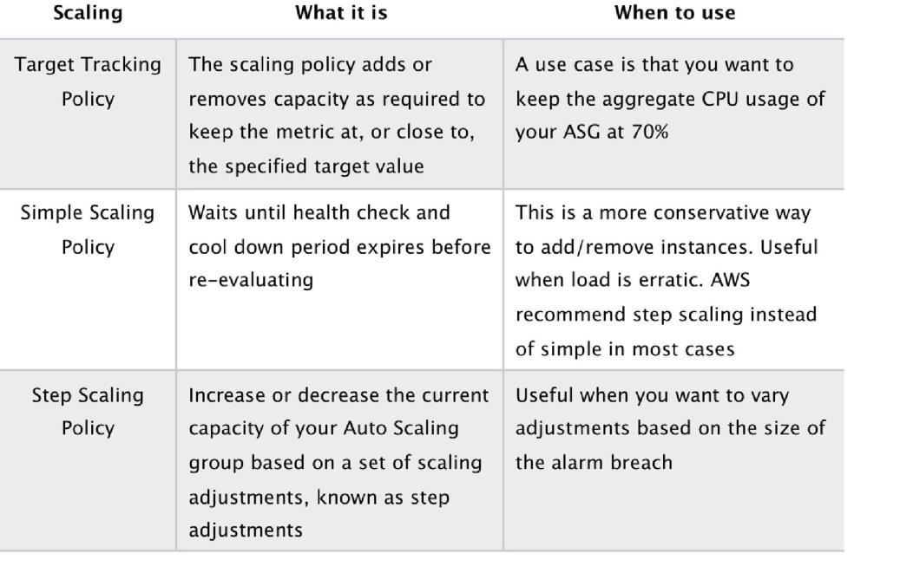

The diagram below depicts an Auto Scaling group with a Scaling policy set to a minimum size of 1 instance, a desired capacity of 2 instances, and a maximum size of 4 instances:


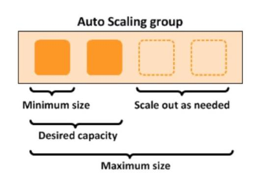

#### **SCALING BASED ON AMAZON SQS**

Can also scale based on an Amazon Simple Queue Service (SQS) queue.

This comes up as an exam question for SAA-C02.

Uses a custom metric that’s sent to Amazon CloudWatch that measures the number of messages in the queue per EC2 instance in the Auto Scaling group.

Then use a target tracking policy that configures your Auto Scaling group to scale based on the custom metric and a set target value. CloudWatch alarms invoke the scaling policy.

Use a custom “backlog per instance” metric to track not just the number of messages in the queue but the number available for retrieval.

Can base off the SQS Metric “ApproximateNumberOfMessages”.

**ASG BEHAVIOR AND CONFIGURATION**

**EC2 Auto Scaling – Termination Policy** :

- Termination policies control which instances are terminated first when a scale-in event occurs.
- There is a default termination policy and options for configuring your own customized termination policies.
- The default termination policy is designed to help ensure that your instances span Availability Zones evenly for high availability.
- The default policy is kept generic and flexible to cover a range of scenarios.

You can define Instance Protection which stops Auto Scaling from scaling in and terminating the instances.

If Auto Scaling fails to launch instances in an AZ it will try other AZs until successful.

The default health check grace period is 300 seconds.

Scale-out is the process in which EC2 instances are launched by the scaling policy.

Scale-in is the process in which EC2 instances are terminated by the scaling policy.

It is recommended to create a scale-in event for each scale-out event created.

Auto Scaling can perform rebalancing when it finds that the number of instances across AZs is not balanced. 

Auto Scaling rebalances by launching new EC2 instances in the AZs that have fewer instances first, only then will it start terminating instances in AZs that had more instances.

Auto Scaling may go over the maximum number of instances by 10% temporarily for the purposes of rebalancing.

**An imbalance may occur due to:**

- Manually removing AZs/subnets from the configuration.
- Manually terminating EC2 instances.
- EC2 capacity issues.
- Spot price is reached.

**Health checks:**

- By default uses EC2 status checks.
- Can also use ELB health checks and custom health checks.
- ELB health checks are in addition to the EC2 status checks.
- If any health check returns an unhealthy status the instance will be terminated.
- With ELB an instance is marked as unhealthy if ELB reports it as OutOfService.
- A healthy instance enters the InService state.
- If an instance is marked as unhealthy it will be scheduled for replacement.
- If connection draining is enabled, Auto Scaling waits for in-flight requests to complete or
    timeout before terminating instances.
- The health check grace period allows a period of time for a new instance to warm up before
    performing a health check (300 seconds by default).

If using an ELB it is best to enable ELB health checks as otherwise EC2 status checks may show an
instance as being healthy that the ELB has determined is unhealthy. In this case the instance will be
removed from service by the ELB but will not be terminated by Auto Scaling.

Elastic IPs and EBS volumes are detached from terminated instances and will need to be manually
reattached.

Using custom health checks a CLI command can be issued to set the instance’s status to unhealthy,

e.g.: 
**_aws autoscaling set–instance-health – instance-id i-123abc45d – health-status Unhealthy_**

Once in a terminating state an EC2 instance cannot be put back into service again.

However, there is a short time period in which a CLI command can be run to change an instance to healthy.

Unlike AZ rebalancing, termination of unhealthy instances happens first, then Auto Scaling attempts to launch new instances to replace terminated instances.

You can manually remove (detach) instances from an ASG using the AWS Console or CLI.

When detaching an instance, you can optionally decrement the ASG’s desired capacity (so it doesn’t launch another instance).

An instance can be attached to one ASG at a time.

You can suspend and then resume one or more of the scaling processes for your Auto Scaling group.

Suspending scaling processes can be useful when you want to investigate a configuration problem or other issue with your web application and then make changes to your application, without invoking the scaling processes.

You can manually move an instance from an ASG and put it in the standby state.

Instances in standby state are still managed by Auto Scaling, are charged as normal, and do not count towards available EC2 instance for workload/application use.

Auto scaling does not perform health checks on instances in the standby state.

Standby state can be used for performing updates/changes/troubleshooting etc. without health checks being performed or replacement instances being launched.

When you delete an ASG the instances will be terminated.

You can choose to use Spot instances in launch configurations and specify a bid price.

Auto Scaling treats spot instances the same as on-demand instances.

You cannot mix Spot instances with on-demand.

If you want to change the bid price you need to create a new launch configuration.

**Auto Scaling can be configured to send an SNS email when:**

- An instance is launched.
- An instance is terminated.
- An instance fails to launch.
- An instance fails to terminate.

**Merging ASGs**

- You can merge multiple single AZ Auto Scaling Groups into a single multi-AZ ASG.
- Merging can only be performed by using the CLI.
- Process is to rezone one of the groups to cover/span the other AZs for the other ASGs.
- Then delete the other ASGs.
- Can be performed on ASGs with or without ELBs attached to them.
- The resulting ASG must be one of the pre-existing ASGs.

**Cooldown Period**

- The cooldown period is a configurable setting for your Auto Scaling group that helps to ensure that it doesn’t launch or terminate additional instances before the previous scaling activity takes effect.
- The default cooldown period is applied when you create your Auto Scaling group.
- The default value is 300 seconds.
- You can configure the default cooldown period when you create the Auto Scaling group, using the AWS Management Console, the create-auto-scaling-group command (AWS CLI), or the CreateAutoScalingGroup API operation.
- Automatically applies to dynamic scaling and optionally to manual scaling but not supported for scheduled scaling.
  
- Can override the default cooldown via scaling-specific cooldown.

**Scheduled:**

- You cannot configure two scheduled activities at the same date/time.
- Scheduled actions can be edited from the AWS Console or CLI.
- Cooldown timer is not supported for scheduled or step on-demand scaling.

**Dynamic:**

- An alarm is an object that watches over a single metric, e.g. CPU/memory/network utilization.
- You need to have a scale-out and a scale-in policy configured.

**Step scaling:**

- Configure multiple steps/adjustments.
- Does not support cool down timers.
- Can respond to multiple alarms and initiate multiple scaling activities.
- Supports a warm-up timer which is the time it will take a newly launched instance to be ready.

The warm-up period is the period of time in which a newly created EC2 instance launched by ASG using step scaling is not considered toward the ASG metrics.

#### **MONITORING**

Basic monitoring sends EC2 metrics to CloudWatch about ASG instances every 5 minutes.

Detailed can be enabled and sends metrics every 1 minute (chargeable).

When the launch configuration is created from the console basic monitoring of EC2 instances is enabled by default.

When the launch configuration is created from the CLI detailed monitoring of EC2 instances is enabled by default.

When you enable Auto Scaling group metrics, Auto Scaling sends sampled data to CloudWatch every minute.

Configure ASG and EC2 monitoring options so they use the same time period, e.g. detailed monitoring (EC2) and 60 seconds (ASG), or basic monitoring (EC2) and 300 seconds (ASG).

#### **LIMITS**

|Name| Default Limit|
|----|--------------|
|Auto Scaling group| 200|
|launch Configurations|20|

### Amazon ECS

#### **GENERAL ECS CONCEPTS**

Amazon Elastic Container Service (ECS) is a highly scalable, high performance container management service that supports Docker containers and allows you to easily run applications on a managed cluster of Amazon EC2 instances.

Amazon ECS eliminates the need for you to install, operate, and scale your own cluster management infrastructure.

Using API calls you can launch and stop container-enabled applications, query the complete state of clusters, and access many familiar features like security groups, Elastic Load Balancing, EBS volumes and IAM roles.

Amazon ECS can be used to schedule the placement of containers across clusters based on resource needs and availability requirements.

There is no additional charge for Amazon ECS. You pay for AWS resources (e.g. EC2 instances or EBS volumes) you create to store and run your application.

Possible to use Elastic Beanstalk to handle the provisioning of an Amazon ECS cluster, balancing load, auto-scaling, monitoring, and placing your containers across your cluster.

Alternatively use ECS directly for more fine-grained control for customer application architectures.

It is possible to associate a service on Amazon ECS to an Application Load Balancer (ALB) for the Elastic Load Balancing (ELB) service.

The ALB supports a target group that contains a set of instance ports. You can specify a dynamic port in the ECS task definition which gives the container an unused port when it is scheduled on the EC2 instance.

ECS provides Blox, a collection of open source projects for container management and orchestration. Blox makes it easy to consume events from Amazon ECS, store the cluster state locally and query the local data store through APIs.

You can use any AMI that meets the Amazon ECS AMI specification.

#### **ECS VS EKS**

Amazon also provide the Elastic Container Service for Kubernetes (Amazon EKS) which can be used
to deploy, manage, and scale containerized applications using Kubernetes on AWS.

The table below describes some of the differences between these services to help you understand
when you might choose one over the other:

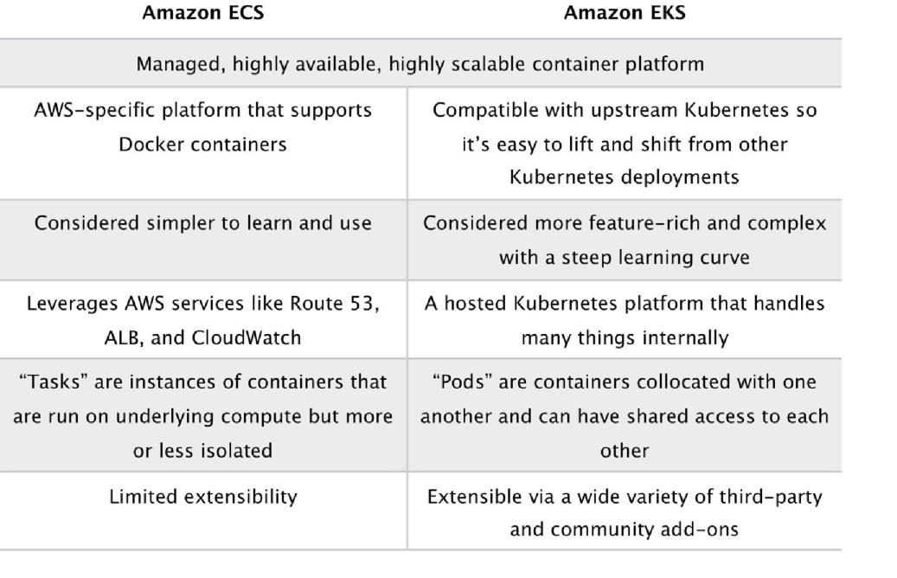

#### **LAUNCH TYPES**

An Amazon ECS launch type determines the type of infrastructure on which your tasks and services are hosted. 

There are two launch types and the table below describes some of the differences between the two launch types:

**Fargate Launch Type** 

- The Fargate launch type allows you to run your containerized applications without the need to provision and manage the backend infrastructure. Just register your task definition and Fargate launches the container for you.
- Fargate Launch Type is a serverless infrastructure managed by AWS.
- Fargate only supports container images hosted on Elastic Container Registry (ECR) or Docker
    Hub.
  
**EC2 Launch Type**

- The EC2 launch type allows you to run your containerized applications on a cluster of Amazon EC2 instances that you manage.
- Private repositories are only supported by the EC2 Launch Type.
The following diagram shows the two launch types and summaries some key differences:

##### **ECS TERMS**

The following table provides an overview of some of the terminology used with Amazon ECS:

TODO

#### **IMAGES**

Containers are created from a read-only template called an image which has the instructions for
creating a Docker container.

Images are built from a Dockerfile.

Only Docker containers are currently supported.

An image contains the instructions for creating a Docker container.

Images are stored in a registry such as DockerHub or AWS Elastic Container Registry (ECR).

ECR is a managed AWS Docker registry service that is secure, scalable and reliable.

ECR supports private Docker repositories with resource-based permissions using AWS IAM in order to access repositories and images.

Developers can use the Docker CLI to push, pull and manage images.

#### **TASKS**

A task definition is required to run Docker containers in Amazon ECS.

A task definition is a text file in JSON format that describes one or more containers, up to a maximum of 10.

Task definitions use Docker images to launch containers.

You specify the number of tasks to run (i.e. the number of containers).

**Some of the parameters you can specify in a task definition include:**

- Which Docker images to use with the containers in your task.
- How much CPU and memory to use with each container.
- Whether containers are linked together in a task.
- The Docker networking mode to use for the containers in your task.
- What (if any) ports from the container are mapped to the host container instances.
- Whether the task should continue if the container finished or fails.
- The commands the container should run when it is started.
- Environment variables that should be passed to the container when it starts.
- Data volumes that should be used with the containers in the task.
- IAM role the task should use for permissions.

You can use Amazon ECS Run task to run one or more tasks once.

#### **CLUSTERS**

ECS Clusters are a logical grouping of container instances the you can place tasks on.

A default cluster is created but you can then create multiple clusters to separate resources.

ECS allows the definition of a specified number (desired count) of tasks to run in the cluster.

Clusters can contain tasks using the Fargate and EC2 launch type.

For clusters with the EC2 launch type clusters can contain different container instance types.

Each container instance may only be part of one cluster at a time.

“Services” provide auto-scaling functions for ECS.

Clusters are region specific.

You can create IAM policies for your clusters to allow or restrict users’ access to specific clusters.

#### **SERVICE SCHEDULER**

You can schedule ECS using Service Scheduler and Custom Scheduler.


Ensures that the specified number of tasks are constantly running and reschedules tasks when a
task fails.

Can ensure tasks are registered against an ELB.

#### **CUSTOM SCHEDULER**

You can create your own schedulers to meet business needs.

Leverage third party schedulers such as Blox.

The Amazon ECS schedulers leverage the same cluster state information provided by the Amazon
ECS API to make appropriate placement decisions.

#### **ECS CONTAINER AGENT**

The ECS container agent allows container instances to connect to the cluster.

The container agent runs on each infrastructure resource on an ECS cluster.

The ECS container agent is included in the Amazon ECS optimized AMI and can also be installed on
any EC2 instance that supports the ECS specification (only supported on EC2 instances).

Linux and Windows based.

For non-AWS Linux instances to be used on AWS you must manually install the ECS container agent.

#### **AUTO SCALING**

##### **Service Auto Scaling**

Amazon ECS service can optionally be configured to use Service Auto Scaling to adjust the desired
task count up or down automatically.

Service Auto Scaling leverages the Application Auto Scaling service to provide this functionality.

**Amazon ECS Service Auto Scaling supports the following types of scaling policies:**

- Target Tracking Scaling Policies—Increase or decrease the number of tasks that your service
    runs based on a target value for a specific CloudWatch metric. This is similar to the way that
    your thermostat maintains the temperature of your home. You select temperature and the
    thermostat does the rest.
- Step Scaling Policies—Increase or decrease the number of tasks that your service runs in
    response to CloudWatch alarms. Step scaling is based on a set of scaling adjustments,
    known as step adjustments, which vary based on the size of the alarm breach.

##### **Cluster Auto Scaling**

This is a new feature released in December 2019. It is unlikely that this will appear on the SAA-C01
exam but could appear on the SAA-C02 exam.

Uses a new ECS resource type called a Capacity Provider.

A Capacity Provider can be associated with an EC2 Auto Scaling Group (ASG).


When you associate an ECS Capacity Provider with an ASG and add the Capacity Provider to an ECS
cluster, the cluster can now scale your ASG automatically by using two new features of ECS:

1. **Managed scaling** , with an automatically-created scaling policy on your ASG, and a new
    scaling metric (Capacity Provider Reservation) that the scaling policy uses; and
2. **Managed instance termination protection** , which enables container-aware termination of
    instances in the ASG when scale-in happens.

#### **SECURITY/SLA**

EC2 instances use an IAM role to access ECS.

IAM can be used to control access at the container level using IAM roles.

The container agent makes calls to the ECS API on your behalf through the applied IAM roles and
policies.

You need to apply IAM roles to container instances before they are launched (EC2 launch type).

AWS recommend limiting the permissions that are assigned to the container instance’s IAM roles.

Assign extra permissions to tasks through separate IAM roles (IAM Roles for Tasks).

ECS tasks use an IAM role to access services and resources.

Security groups attach at the instance or container level.

You have root level access to the operating system of the EC2 instances.

The Compute SLA guarantees a Monthly Uptime Percentage of at least 99.99% for Amazon ECS.

#### **LIMITS**

**Soft limits (default):**

- Clusters per region = 1000.
- Instances per cluster = 1000.
- Services per cluster = 500.

**Hard limits:**

- One load balancer per service.
- 1000 tasks per service (the “desired” count).
- Max 10 containers per task definition.
- Max 10 tasks per instance (host).

#### **PRICING**

**EC2 Launch Type:**

No additional charge – you pay for the EC2 resources you launch including instances, EBS volumes
and load balancers

**Fargate:**

You pay for the vCPU and memory allocated to the containers you run.


### AWS Lambda

#### **GENERAL LAMBDA CONCEPTS**

AWS Lambda lets you run code as functions without provisioning or managing servers.

Lambda-based applications (also referred to as serverless applications) are composed of functions
triggered by events.

With serverless computing, your application still runs on servers, but all the server management is
done by AWS.

You cannot log in to the compute instances that run Lambda functions or customize the operating
system or language runtime.

**Lambda functions:**

- Consist of code and any associated dependencies.
- Configuration information is associated with the function.
- You specify the configuration information when you create the function.
- API provided for updating configuration data.

You specify the amount of memory you need allocated to your Lambda functions.

AWS Lambda allocates CPU power proportional to the memory you specify using the same ratio as
a general purpose EC2 instance type.

**Functions can access:**

- AWS services or non-AWS services.
- AWS services running in VPCs (e.g. RedShift, Elasticache, RDS instances).
- Non-AWS services running on EC2 instances in an AWS VPC.

To enable your Lambda function to access resources inside your private VPC, you must provide
additional VPC-specific configuration information that includes VPC subnet IDs and security group
IDs.

AWS Lambda uses this information to set up elastic network interfaces (ENIs) that enable your
function.

**Compute resources:**

- You can request additional memory in 64MB increments from 128MB to 3008MB.
- Functions larger than 1536MB are allocated multiple CPU threads, and multi-threaded or
    multi-process code is needed to take advantage.

**There is a maximum execution timeout.**

- Max is 15 minutes (900 seconds), default is 3 seconds.
- You pay for the time it runs.
- Lambda terminates the function at the timeout.

Code is invoked using API calls made using AWS SDKs.


Lambda assumes an IAM role when it executes the function.

The handler name refers to the method in your code where Lambda begins execution.

**The components of AWS Lambda are:**

- A Lambda function which is comprised of your custom code and any dependent libraries.
- Event sources such as SNS or a custom service that triggers your function and executes its
    logic.
- Downstream resources such as DynamoDB or Amazon S3 buckets that your Lambda
    function calls once it is triggered.
- Log streams are custom logging statements that allow you to analyze the execution flow
    and performance of your Lambda function.

Lambda is an event-driven compute service where AWS Lambda runs code in response to events
such as changes to data in an S3 bucket or a DynamoDB table.

An event source is an AWS service or developer-created application that produces events that
trigger an AWS Lambda function to run.

Event sources are mapped to Lambda functions.

Event sources maintain the mapping configuration except for stream-based services (e.g.
DynamoDB, Kinesis) for which the configuration is made on the Lambda side and Lambda performs
the polling.

**Supported AWS event sources include:**

- Amazon S3.
- Amazon DynamoDB.
- Amazon Kinesis Data Streams.
- Amazon Simple Notification Service.
- Amazon Simple Email Service.
- Amazon Simple Queue Service.
- Amazon Cognito.
- AWS CloudFormation.
- Amazon CloudWatch Logs.
- Amazon CloudWatch Events.
- AWS CodeCommit.
- Scheduled Events (powered by Amazon CloudWatch Events).
- AWS Config.
- Amazon Alexa.
- Amazon Lex.
- Amazon API Gateway.
- AWS IoT Button.
- Amazon CloudFront.
- Amazon Kinesis Data Firehose.
- Other Event Sources: Invoking a Lambda Function On Demand.

Other event sources can invoke Lambda functions on-demand (application needs permissions to


invoke the Lambda function).

Lambda can run code in response to HTTP requests using Amazon API gateway or API calls made
using the AWS SDKs.

AWS Lambda supports code written in Node.js (JavaScript), Python, Java (Java 8 compatible), C#
(.NET Core), Ruby, Go and PowerShell.

AWS Lambda stores code in Amazon S3 and encrypts it at rest.

Continuous scaling – scales out not up.

Lambda scales concurrently executing functions up to your default limit (1000).

Lambda functions are serverless and independent, 1 event = 1 function.

Functions can trigger other functions so 1 event can trigger multiple functions.

For non-stream-based event sources each published event is a unit of work, run in parallel up to
your account limit (one Lambda function per event)2.

For stream-based event sources the number of shards indicates the unit of concurrency (one
function per shard).

Lambda works globally.

To enable VPC support, you need to specify one or more subnets in a single VPC and a security
group as part of your function configuration.

Lambda functions provide access only to a single VPC. If multiple subnets are specified, they must
all be in the same VPC.

Lambda functions configured to access resources in a particular VPC will not have access to the
Internet as a default configuration. If you need access to external endpoints, you will need to create
a NAT in your VPC to forward this traffic and configure your security group to allow this outbound
traffic.

Versioning can be used to run different versions of your code.

Each Lambda function has a unique Amazon Resource Name (ARN) which cannot be changed after
publishing.

**Use cases fall within the following categories:**

- Using Lambda functions with AWS services as event sources.
- On-demand Lambda function invocation over HTTPS using Amazon API Gateway (custom
    REST API and endpoint).
- On-demand Lambda function invocation using custom applications (mobile, web apps,
    clients) and AWS SDKs, AWS Mobile SDKs, and the AWS Mobile SDK for Android.
- Scheduled events can be configured to run code on a scheduled basis through the AWS
    Lambda Console.

#### **BUILDING LAMBDA APPS**

You can deploy and manage your serverless applications using the AWS Serverless Application
Model (AWS SAM).


AWS SAM is a specification that prescribes the rules for expressing serverless applications on AWS.

This specification aligns with the syntax used by AWS CloudFormation today and is supported
natively within AWS CloudFormation as a set of resource types (referred to as “serverless
resources”).

You can automate your serverless application’s release process using AWS CodePipeline and AWS
CodeDeploy.

You can enable your Lambda function for tracing with AWS X-Ray.

#### **LAMBDA@EDGE**

Lambda@Edge allows you to run code across AWS locations globally without provisioning or
managing servers, responding to end users at the lowest network latency.

Lambda@Edge lets you run Node.js and Python Lambda functions to customize content that
CloudFront delivers, executing the functions in AWS locations closer to the viewer.

The functions run in response to CloudFront events, without provisioning or managing servers.

**You can use Lambda functions to change CloudFront requests and responses at the following
points:**

- After CloudFront receives a request from a viewer (viewer request).
- Before CloudFront forwards the request to the origin (origin request).
- After CloudFront receives the response from the origin (origin response).
- Before CloudFront forwards the response to the viewer (viewer response).

You just upload your Node.js code to AWS Lambda and configure your function to be triggered in
response to an Amazon CloudFront request.

The code is then ready to execute across AWS locations globally when a request for content is
received, and scales with the volume of CloudFront requests globally.

#### **LIMITS**

Memory – minimum 128MB, maximum 3008MB in 64MB increments.

Ephemeral disk capacity (/tmp space) per invocation – 512 MB.

Number of file descriptors – 1024.

Number of processes and threads (combined) – 1024.

Maximum execution duration per request – 900 seconds.

Concurrent executions per account – 1000 (soft limit).

#### **OPERATIONS AND MONITORING**

Lambda automatically monitors Lambda functions and reports metrics through CloudWatch.

Lambda tracks the number of requests, the latency per request, and the number of requests
resulting in an error.

You can view the request rates and error rates using the AWS Lambda Console, the CloudWatch


console, and other AWS resources.

X-Ray is an AWS service that can be used to detect, analyze and optimize performance issues with
Lambda applications.

X-Ray collects metadata from the Lambda service and any upstream and downstream services that
make up your application.

Lambda is integrated with CloudTrail for capturing API calls and can deliver log files to your S3
bucket.

#### **CHARGES**

**Priced based on:**

- Number of requests. First 1 million are free then $0.20 per 1 million.
- Duration. Calculated from the time your code begins execution until it returns or
    terminates. Depends on the amount of memory allocated to a function.

### AWS Elastic Beanstalk

AWS Elastic Beanstalk can be used to quickly deploy and manage applications in the AWS Cloud.

Developers upload applications and Elastic Beanstalk handles the deployment details of capacity
provisioning, load balancing, auto-scaling, and application health monitoring.

AWS Elastic Beanstalk leverages Elastic Load Balancing and Auto Scaling to automatically scale your
application in and out based on your application’s specific needs.

In addition, multiple availability zones give you an option to improve application reliability and
availability by running in more than one zone.

Considered a Platform as a Service (PaaS) solution.

Supports Java, .NET, PHP, Node.js, Python, Ruby, Go, and Docker web applications.

**Supports the following languages and development stacks:**

- Apache Tomcat for Java applications
- Apache HTTP Server for PHP applications
- Apache HTTP Server for Python applications
- Nginx or Apache HTTP Server for Node.js applications
- Passenger or Puma for Ruby applications
- Microsoft IIS 7.5, 8.0, and 8.5 for .NET applications
- Java SE
- Docker
- Go

Integrates with VPC.

Integrates with IAM.

Can provision most database instances.


Allows full control of the underlying resources.

Stores your application files and, optionally, server log files in Amazon S3.

Application data can also be stored on S3.

Multiple environments are supported to enable versioning.

Changes from Git repositories are replicated.

Linux and Windows 2008 R2 AMI support.

Code is deployed using a WAR file or Git repository.

Use the AWS toolkit for Visual Studio and the AWS toolkit for Eclipse to deploy Elastic Beanstalk.

Fault tolerance within a single region.

By default, applications are publicly accessible.

Provides integration with CloudWatch.

Can adjust application server settings.

Can access logs without logging into application servers.

Can use CloudFormation to deploy Elastic Beanstalk.

There is no additional charge for Elastic Beanstalk – you pay only for the AWS resources needed to
store and run your applications.


### Compute Quiz Questions

Answers and explanations are provided below after the last question in this section.

**Question 1: What do you need to securely connect using SSH to an EC2 instance launched from
the Amazon Linux 2 AMI?**

1. A signed cookie
2. An access key ID and secret access key
3. A key pair
4. A password

**Question 2: What can you use to run a script at startup on an Amazon EC2 Linux instance?**

1. User data
2. Metadata
3. AWS Batch
4. AWS Config

**Question 3: Which EC2 pricing model would you use for a short-term requirement that needs to
complete over a weekend?**

1. Reserved Instance
2. Spot Instance
3. Dedicated Instance
4. On-Demand Instance

**Question 4: An organization uses an application that uses per-socket licensing and they need full
control over the placement of their EC2 instances on underlying hardware. What should they use?**

1. Dedicated instances
2. Dedicated hosts
3. Spot instances
4. Reserved instances

**Question 5: What type of storage is suitable for a use case that requires extremely high-
performance local disks that do not need to be persistent?**

1. Elastic Block Store (EBS)
2. Snapshots
3. Instance Store
4. Amazon S3

**Question 6: Which type of network adapter should be used for High Performance Computing
(HPC) uses cases that include tightly coupled applications?**

1. Elastic Fabric Adapter (EFA)
2. Elastic Network Interface (ENI)
3. Elastic Network Adapter (ENA)

**Question 7: An Architect would like to use an Elastic Load Balancer to forward traffic to different
back-end applications for https://dctlabs.com/orders and https://dctlabs.com/account. Which
type of ELB should be used?**


1. Application Load Balancer with path-based routing
2. Application Load Balancer with host-based routing
3. Network Load Balancer with TCP port-based routing
4. Classic Load Balancer with Layer 7 routing

**Question 8: How can a systems administrator copy an EBS volume from the us-west-1a
availability zone to an instance in the us-west-1b availability zone?**

1. Create a snapshot of the EBS volume in us-west-1a. Create a new volume in us-west-2b
    from the snapshot
2. Create a new EBS volume attached to the instance in us-west-2b. Attach the EBS volume to
    the instance in us-west-1b and copy data between volumes

**Question 9: Which type of data volume provides very high performance and is ideal for storing data which is either replicated between EC2 instances or is only temporary and can be lost?**

1. Elastic Block Store (EBS)
2. Instance Store

**Question 10: The development department in your organization need to quickly access a platform for running Docker containers. The platform service should be fully managed. Which AWS service
should you provision for them?**

1. Amazon Elastic Container Service (ECS) with the EC2 launch type
2. Amazon Elastic Container Service (ECS) with the Fargate launch type
3. Amazon Elastic Kubernetes Service (EKS)
4. Amazon Elastic Container Registry (ECR)

**Question 11: How can auto scaling be implemented for the ECS cluster instances?**

1. This is not possible, you can only auto scale tasks using services
2. Using a Capacity Provider that is associated with an Auto Scaling Group (ASG)
3. Using AWS Auto Scaling for Amazon ECS

**Question 12: You have some code that you would like to run occasionally and need to minimize
costs. The completion time is typically under 10 minutes. Which solution is cost-effective and
operationally efficient?**

1. Run the code on an Amazon EC2 instance
2. Run the code on an Amazon ECS task
3. Run the code using AWS Batch
4. Run the code using an AWS Lambda function

**Question 13: Which of the following listener / protocol combinations is INCORRECT?**

1. Application Load Balancer TCP and HTTP/HTTPS
2. Classic Load Balancer TCP and HTTP/HTTPS
3. Network Load Balancer TCP

**Question 14: Which type of scaling is provided by Amazon EC2 Auto Scaling?**

1. Vertical
2. Horizontal


**COMPUTE - ANSWERS**

**Question 1, Answer: 3**

**Explanation:**

```
1 is incorrect. Signed cookies are not an authentication method for EC2.
2 is incorrect. An access key ID and secret access key are used for programmatic access to AWS
services, not for securely connecting to Linux instances over SSH. Make sure you know the
difference between these two concepts.
3 is correct. Key pairs are used to securely connect to EC2 instances. A key pair consists of a
public key that AWS stores, and a private key file that you store. For Linux AMIs, the private
key file allows you to securely SSH (secure shell) into your instance.
4 is incorrect. You do not need a password to connect to instances launched from the Amazon
Linux 2 AMI.
```
**Question 2, Answer: 1**

**Explanation:**

```
1 is correct. User data is data that is supplied by the user at instance launch in the form of a
script.
2 is incorrect. Instance metadata is data about your instance that you can use to configure or
manage the running instance.
3 is incorrect. AWS Batch is used for running batch computing jobs across many instances.
4 is incorrect. AWS Config is a service that enables you to assess, audit, and evaluate the
configurations of your AWS resources.
```
**Question 3, Answer: 4**

**Explanation:**

```
1 is incorrect. Reserved instances require a commitment over 1 or 3 years.
2 is incorrect. Spot instances are good for cost-sensitive workloads that can afford to be
interrupted. This workload must complete so Spot instances would not be ideal.
3 is incorrect. Dedicated Instances are Amazon EC2 instances that run in a VPC on hardware
that's dedicated to a single customer. This would be more expensive and there is no need for
dedicated hardware in this case.
4 is correct. On-demand instances are ideal for short-term or unpredictable workloads. You don’t
get a discount, but you do have more flexibility with no commitments.
```
**Question 4, Answer: 2**

**Explanation:**

```
1 is incorrect. Dedicated instances provide dedicated hardware, but you don’t get visibility of
sockets, cores, or targeted instance placement.
2 is correct. Dedicated hosts provide dedicated hardware and they give you full visibility of
sockets and cores and targeted instance placement.
3 is incorrect. With Spot instances you do not have control of instance placement on underlying
hardware.
4 is incorrect. With Reserved instances you do not have control of instance placement on
```

```
underlying hardware.
```
**Question 5, Answer: 3**

**Explanation:**

```
1 is incorrect. EBS volumes are persistent. You can get high performance, but they are network
attached disks, not local disks.
2 is incorrect. Snapshots are used for taking a backup of EBS volumes.
3 is correct. Instance store volumes are ephemeral (non-persistent) local disks that offer very
high performance.
4 is incorrect. Amazon S3 is an object storage system. It is not a local disk nor is it non-persistent.
```
**Question 6, Answer: 1**

**Explanation:**

```
1 is correct. EFA is good for High Performance Computing, MPI and ML use cases, tightly coupled
applications and can be used with all instance types.
2 is incorrect. ENIs are the basic adapter type for when you don’t have any high-performance
requirements.
3 is incorrect. ENAs are good for use cases that require higher bandwidth and lower inter-
instance latency.
```
**Question 7, Answer: 1**

**Explanation:**

```
1 is correct. To forward based on the path (e.g. /orders or /account) you can use the ALB with
path-based routing.
2 is incorrect. Host-based routing uses the host name (e.g. dctlabs.com or amazon.com) rather
than the path (e.g. /orders or /account).
3 is incorrect. The NLB can forward based on different ports/listeners. However all of this traffic
will be coming on the single port for HTTPS (443).
4 is incorrect. The CLB is a layer 7 router but there is not concepts of path-based routing.
```
**Question 8, Answer: 1**

**Explanation:**

```
1 is correct. This is the best method for copying an EBS volume between AZs. Remember,
snapshots are stored on Amazon S3 which stores data within a region, not an AZ.
2 is incorrect. You cannot attach an EBS volume to an instance in a different AZ.
```
**Question 9, Answer: 2**

**Explanation:**

```
1 is incorrect. EBS is persistent storage and though it provides high performance it may not be
the best solution for data that is replicated or can be lost.
2 is correct. This is a good use case for Instance Store storage. It can also be cost-effective as it
comes with the price of the EC2 instance.
```
**Question 10, Answer: 2**


**Explanation:**

```
1 is incorrect. The EC2 launch type is not a fully managed service.
2 is correct. The Fargate launch type is a fully managed service.
3 is incorrect. EKS is a managed service running the Kubernetes control plane. There are no
specific requirements here for using Kubernetes so this is not the best option for quickly
creating a platform for the developers.
4 is incorrect. ECR is a registry for storing container images.
```
**Question 11, Answer: 2**

**Explanation:**

```
1 is incorrect. This is no longer true since a recent feature update. Watch out for updates on the
exam!
2 is correct. This is a new feature that may start appearing on the SAA-C02 version of the exam.
3 is incorrect. AWS Auto Scaling for Amazon ECS is not something that exists.
```
**Question 12, Answer: 4**

**Explanation:**

```
1 is incorrect. An EC2 instance is not cost-effective for a workload that needs to run only
occasionally for 10 minutes.
2 is incorrect. An ECS task is not the most operationally effective option as you must spin up the
ECS task to run the code and then manage the deletion of the task.
3 is incorrect. AWS Batch is used for running batch computing jobs on many EC2 instances. It’s
not cost-effective or operationally effective for this use case.
4 is correct. This is the most cost-effective and operationally effective option. Remember that
the maximum execution time is 900 seconds (15 minutes) so you are well within that
timeframe here.
```
**Question 13, Answer: 1**

**Explanation:**

```
1 is correct. The ALB only support layer 7 which is HTTP and HTTPS – not TCP.
2 is incorrect. This is a correct combination of listener / protocol.
3 is incorrect. This is a correct combination of listener / protocol.
```
**Question 14, Answer: 2**

**Explanation:**

```
1 is incorrect. EC2 Auto Scaling is not an example of vertical scaling.
2 is correct. EC2 Auto Scaling scales horizontally by launching or terminating EC2 instances.
```