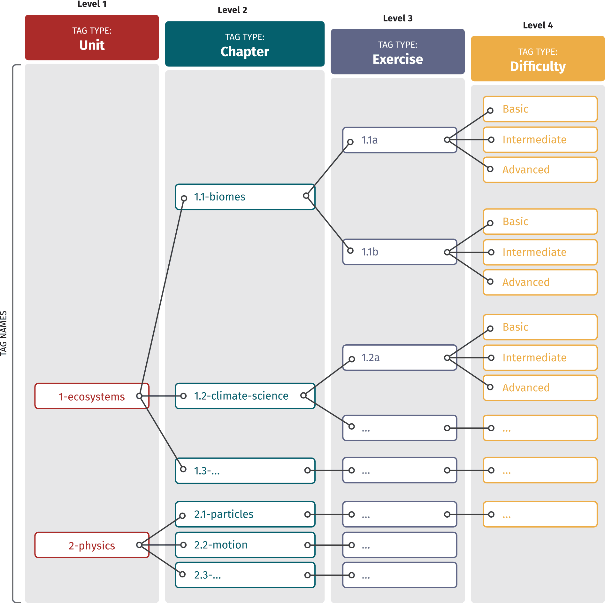

# README

First draft content about new bot focus on `AWS Solution Architect Trainer Bot`

The bot will focus UX/UI on Trainer Bot including:

- Course study model: 
  - SR learning model to help on learning slowly and consistently
- Practice model for prepare a certificate examination:
    - **Exam Mode**
      In exam simulation mode, you complete one full-length practice exam and answer all 65 questions within the allotted time. You are then presented with a pass / fail score report showing your overall score and performance in each knowledge area to identify your strengths and weaknesses.
    - **Training Mode**
  When taking the practice exam in training mode, you will be shown the answers and explanations for every question after clicking “check”. Upon completion of the exam, the score report will show your overall score and performance in each knowledge area.
    - **Knowledge Reviews**
  Now that you have identified your strengths and weaknesses, you get to dive deep into specific areas with our knowledge reviews. You are presented with a series of questions focussed on a specific topic. There is no time limit and you can view the answer to each question as you go through them.
  - **Final Exam Simulator**
  The exam simulator randomly selects 65 questions from our pool of over 500 unique questions – mimicking the real AWS exam environment. The practice exam has the same format, style, time limit and passing score as the real AWS exam

## Implementation ideal   

We can reuse the SR system for course study learning model but we need more on UX including:

- Instead of just pickup the cards: we create review session and learning new session
- A knowledge repo == A study course , a session == a deck. Each session including many cards relative its topic. 

The reminder on noat.cards bot should be modified to archive 2 different things bellow: 

- Remember the last check point ? and resume from the last check point when people want to continue learning from the last check point 
- Apply review the old knowledge follow SR concept. 
- Verifying knowledge on a session by quiz test which including quiz questions defined/assigned for the session and auto ranking the knowledge belong the session based on grade score of quiz test.


## Implementation in action

### Modeling the schema of knowledge repo 

```yaml
type: noatcards
contents:
  - file: "01_aws_compute.md"
    tags: "ec2,...." 
    test:
      - file: "01_aws_compute_quiz.md"
        tags: "
```

Questions sample: 

```markdown
**Question 13: Which of the following listener / protocol combinations is INCORRECT?** 

1. Application Load Balancer TCP and HTTP/HTTPS
2. Classic Load Balancer TCP and HTTP/HTTPS
3. Network Load Balancer TCP

#load_balancer #LB #<what_is_the_test_domain_of_question>
#ALB #CLB #NLB #app_loadbalancer #classic_loadbalancer #network_loadbalancer

#parent_tag1 #parent_tag1 #parent_tag3  // parent groups tags: components, question domain 
#itself_tag1 #itself_tag2 #itself_tag3  //attribute/catalog of the question
```

there have two options here: 

- Inline tagging: Local tags 
- Schema file tagging: Global tags for each quiz collection file, apply for all question on the quiz collection file

Each question will content 2 tag lines: 

- Tags address level: to identify the question belong to what group for easy to graph between question and knowledge
- Free style tag: for tagging only, attribute of question. 


## Test Domains 

Need to consider 4 test domains for aws certification: 

### **Test Domain 1: Design Resilient Architectures**

This domain makes up 30% of the exam and includes the following four objectives:

- 1.1 Design a multi-tier architecture solution.
- 1.2 Design highly available and/or fault-tolerant architectures.
- 1.3 Design decoupling mechanisms using AWS services.
- 1.4 Choose appropriate resilient storage.

**What you need to know**

You need to understand the various block, file and object storage technologies such as Amazon EBS, Instance Store, Amazon EFS, Amazon S3, and Amazon FSx and know their use cases.

You must be able to design multi-tier application architectures and know-how to decouple application components using technologies such as Amazon SQS and Amazon SWF.

The architectures also need to be highly available in the case of component failure, and able to recover in the case of major outages, so you need to know the various ways of implementing high availability and fault tolerance.

Technologies you need to understand include Amazon Elastic Load Balancing, Amazon Route 53 and Amazon RDS Read Replicas and Multi-AZ.

You also need to understand the AWS Global Infrastructure in order to determine how to design application stacks to best use the underlying infrastructure architecture.

### **Test Domain 2: Design High-Performing Architectures**

This domain makes up 28% of the exam and includes the following **objectives** :

- 2.1 Identify elastic and scalable compute solutions for a workload.
- 2.2 Select high-performing and scalable storage solutions for a workload.
- 2.3 Select high-performing networking solutions for a workload.
- 2.4 Choose high-performing database solutions for a workload.

**What you need to know**

You need to be able to select the best storage and database services to use for a given scenario, taking into account requirements for performance.

Technologies to increase performance may include a caching layer such as Amazon ElastiCache, Amazon DynamoDB DAX, or Amazon CloudFront and you must be able to select the best service to use in the situation presented.

You must know how to effectively implement elasticity and scalability to your application architectures. This means understanding at an architectural and implementation level what to use and how to build it.

Elasticity and scalability services you need to understand, include AWS Auto Scaling, EC2 Auto Scaling, and how to implement these features at the application, storage, and database layers of your application using AWS technology.


### **Test Domain 3: Design Secure Applications and Architectures**

This domain makes up 24% of the exam and includes the following three objectives:

- 3.1 Design secure access to AWS resources.
- 3.2 Design secure application tiers.
- 3.3 Select appropriate data security options.

**What you need to know**

You need to understand how to use native AWS technologies and solution architecture to create secure applications. This includes configuring security controls for authentication, authorization, and access and applying encryption to data.

You need to know how to design isolation and separation through AWS service architecture, Amazon EC2 instance deployment options and Amazon VPC configuration.

It is also recommended to understand the best practices for implementing services in the most secure manner and best practices for creating users, groups, and roles using AWS IAM. Which services can use multi-factor authentication is also required knowledge and you should understand the available AWS Directory Services at a high-level and when to use them.

Questions often come up asking you to identify which technologies include DDoS mitigation and these include AWS Auto Scaling, Amazon CloudFront, and Amazon Route 53.

You should also know how to implement monitoring and logging using Amazon CloudWatch and AWS CloudTrail, when and what penetration testing you are allowed to perform within the AWS cloud and what compliance programs AWS comply with.

Technologies you need to know for domain 3 include Amazon VPC, AWS KMS, AWS CloudHSM, AWS IAM, Amazon Cognito, and AWS Directory Services.


### **Test Domain 4: Design Cost-Optimized Architectures**

This domain makes up 18% of the exam and includes the following objectives:

- 4.1 Identify cost-effective storage solutions.
- 4.2 Identify cost-effective compute and database service.
- 4.3 Design cost-optimized network architectures.

**What you need to know**

A relatively small but still important area of the exam requires architects to consider cost- effectiveness when deploying application on AWS. You need to understand the various cost models of compute and storage services, what you pay for and what the best choices would be given a specific scenario.

## What do I want ? 

a course study with well structure hierarchy base on unit-chaper-exercise-difficulty ? 



But also have another graph linked network using tags/hashtags : 

for AWS solution architecture study course, we need including some tags: 

- Test domain tag for each quiz questions:
  Domain 1,2,3,4 follow defined above
```
#domain1 #domain2 #domain3 #domain4
```  

- Question relate to what unit/topic: 
```
#ec2 #elb
```
- The difficult level of question
`#easy #hard #normal`

by hashtags/tag we can define really dynamic test for simulate aws certificate test. 

for each domain: we have ratio: 30% - 24% -28% - 18%. 
We create simple query to create test:

`from quiz_test_table select question which domain == domain_1 ... other filter here`

And also easy to create a quiz test for each unit/section

`from quiz_test_table select question which question.tags like "ec2"... other filter here` 
by this way, we can create a test which wide domain test level  

there have two steps on lession/unit test: 
- 1 components relative only for learning: which the kind, focus on question relate on current learning session/unit 
- Review test but focus on components: wide level , relative to the current lession but also reference to other lesion. wide domain test level 


